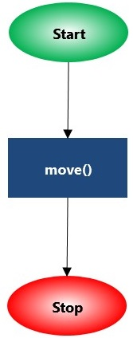

Étape 0: Transition vers le texte
===================================

.. topic:: Aperçu rapide de la journée

    Explorez |reeborg_environment| et les commandes de base disponibles pour Reeborg. Présentez les étapes que les étudiants suivront. Contrairement au reste des pages de ce manuel, les étapes qui suivent ne correspondent pas facilement à une seule période de classe. Certaines premières étapes prendront très peu de temps aux étudiants, et certaines étapes ultérieures leur prendront beaucoup de temps. L’utilisation prévue de ces étapes est de donner aux étudiants environ deux semaines de temps en classe pour travailler sur les étapes à leur propre rythme.

.. reveal:: curriculum_addressed_etape_0
    :showtitle: Résultats du programme d'études traités dans cette section. 
    :hidetitle: Cacher les résultat du programme

    - **CS20-CP1** Apply various problem-solving strategies to solve programming problems throughout Computer Science 20.

Si vous préférez regarder une vidéo présentant Reeborg, la `vidéo suivante <https://www.youtube.com/watch?v=GSszijgTFxU>`_ illustre les mêmes idées que celles décrites dans le texte ci-dessous.

.. youtube:: GSszijgTFxU
    :height: 315
    :width: 560
    :align: left
    :http: https

Introduction
------------

Bien que vous puissiez apprendre beaucoup en utilisant un environnement comme Scratch, nous souhaitons insister sur le fait que ce que vous avez appris fonctionne également avec un langage de programmation plus traditionnel. Dans ce cours, le langage de programmation traditionnel que nous utiliserons s'appelle `Python <https://www.python.org/>`_. Au lieu de nous lancer directement dans l’utilisation de Python, nous allons continuer à explorer la programmation en utilisant un environnement appelé Reeborg. En utilisant Reeborg, nous allons commencer à taper des commandes Python, plutôt que de simplement les faire glisser comme nous l’avons fait avec Scratch. Cela vous permet de commencer à faire des erreurs de syntaxe (en d’autres termes, si vous tapez quelque chose que l’ordinateur ne comprend pas, cela ne fonctionnera pas), tout en vous donnant un retour visuel sur vos programmes.

La première étape de Reeborg
------------------------------

Ouvrez |reeborg_environment|. Si le monde de l'étape 0 ne s'ouvre pas par défaut, sélectionnez-le dans le menu du monde:

Vous devriez maintenant voir le robot, Reeborg, seul dans un monde vide. Malheureusement, Reeborg est un robot usagé et ne peut donc exécuter que quelques commandes de base. Une chose que Reeborg peut faire est d’avancer, comme ceci:

.. figure:: images/move.png
   :align: center

.. figure:: images/move_one_step.gif
   :align: center    

Dans le panneau d'édition, il n'y a qu'une seule instruction:

    move()

``move()`` est un exemple de **fonction** Python. Une fonction a un nom; dans ce cas, c'est ``move``. Les noms valides doivent commencer par une lettre ou par le caractère de soulignement «_» et peuvent contenir des lettres, des chiffres ou le caractère de soulignement «_». Le nom de la fonction est suivi de ``()``. Cela indique à Reeborg (Python) que la fonction doit être *exécutée* ou *appelée* (deux synonymes). Cette fonction doit être sur une ligne à part. [Nous verrons une exception à cette règle plus tard.]

Parfois, nous ferons des **organigrammes** qui sont des représentations graphiques d'un programme. Dans un organigramme, une instruction unique telle que ``move()`` peut être représentée comme ceci:

.. figure:: images/flowcharts/move1.jpg
   :align: center

et un programme complet contenant une seule instruction serait représenté comme ceci:

Dans un organigramme, la séquence d'instructions suit les flèches, commençant par «Démarrer» et se terminant par «Arrêter».

.. topic:: Essaye ça!

    Ajoutez une deuxième instruction ``move()`` pour que Reeborg effectue deux étapes au lieu d’une seule.

.. hint::

   Chaque instruction doit apparaître sur sa propre ligne, sans espace supplémentaire au début de la ligne.

Faire face aux eRRoRs
----------------------

En écrivant des programmes informatiques, vous ferez probablement de nombreuses erreurs. Pour voir comment Reeborg réagit à certaines erreurs, je vous demanderai d'introduire intentionnellement une erreur dans le programme.

.. topic:: Essaye ça!

    Changez ``move()`` à ``Move()`` (avec un M majuscule) et essayez d’exécuter le programme.

Python, le langage compris par Reeborg, est «sensible à la casse»; c'est-à-dire que les lettres minuscules ont une signification différente de celle des majuscules. Maintenant que vous voyez comment Reeborg traite les erreurs, revenez en arrière, corrigez le programme et exécutez la version corrigée.

Un outil spécial pour vous aider
----------------------------------

Au sommet du monde de Reeborg, vous trouverez un bouton intitulé **Clavier de Reeborg** “*Reeborg’s keyboard*”. Si vous cliquez dessus, un clavier spécial apparaîtra. En cliquant sur chaque bouton, l'instruction correspondante, le mot-clé Python, etc., seront automatiquement insérés dans l'éditeur. Cela peut être utile pour s'assurer que les noms sont épelés correctement et que les parenthèses requises ne sont pas oubliées.

Prochaines étapes
-------------------

Les leçons suivantes vous fourniront des défis à relever. Bien que vous puissiez les compléter dans n'importe quel ordre, l'ordre dans lequel elles sont présentées révélera les capacités de Reeborg dans un ordre logique. Lorsque vous avez terminé une étape, il est judicieux de montrer votre solution à votre enseignant afin de confirmer que vous avez créé une solution appropriée au problème. Bien que les mondes aient été créés pour vous donner une rétroaction instantanée, il peut être très utile de demander à un humain expérimenté de vous donner des conseils!

Remerciements
-------------------

Reeborg est une adaptation moderne d'un environnement appelé Karel the Robot, créé par Richard Pattis à l'Université de Stanford en 1981. La version que nous allons utiliser a été créée par André Roberge. Les tutoriels que vous utiliserez sont une adaptation de tutoriels réalisés par Roger Frank, Jeffrey Elkner, André Roberge et Dan Schellenberg.

.. |reeborg_environment| raw:: html

   <a href="https://reeborg.cs20.ca/?lang=en&mode=python&menu=worlds/menus/sk_menu.json&name=Step%200" target="_blank">l'environnement Reeborg</a>

