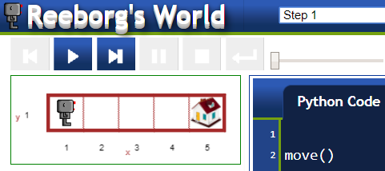
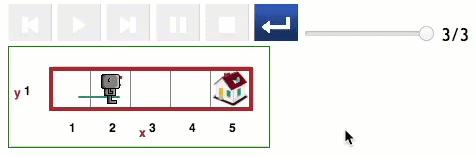

Étape 1: Envoie Reeborg chez lui et enregistrez votre travail
==============================================================

.. reveal:: curriculum_addressed_etape_1
    :showtitle: Résultats du programme d'études traités dans cette section. 
    :hidetitle: Cacher les résultat du programme

    - **20IN-PT.1** Appliquer diverses stratégies de résolution de problèmes pour résoudre des problèmes de programmation dans le cours d’Informatique 20.

Didacticiel-*Tutorial*
-----------------------

Dans certains mondes, Reeborg peut avoir un endroit spécifique à atteindre. Par exemple, lorsque vous ouvrez le monde Step 1, vous verrez une image de la maison de Reeborg.

Le monde de Reeborg est une grille simple, et nous pouvons faire référence à n’importe quelle partie de la grille en utilisant une coordonnée x et y. C'est pareil qu'un plan cartésien en maths! Dans ce monde, Reeborg doit rentrer chez lui, ce qui correspond à x = 5 et à y = 1 ou (5,1).

Sauvegarder votre travail
---------------------------

Bien que le code que vous créez pour ces premiers mondes soit relativement simple, vous voudrez enregistrer votre code au fur et à mesure de votre progression.

Pour enregistrer votre code sur votre ordinateur, vous pouvez cliquer sur le bouton Enregistrer. Pour ouvrir le code que vous avez enregistré sur votre ordinateur, utilisez le bouton Ouvrir.

Si vous ne voyez pas les boutons Enregistrer et Ouvrir, vous devrez peut-être appuyer sur le bouton Recharger, comme indiqué ci-dessous:

Si vous préférez utiliser un raccourci clavier, vous pouvez enregistrer le code que vous avez créé à l'aide du raccourci clavier **Ctrl-S** (**Cmd-S** sur un Mac). Pour charger le code que vous avez précédemment enregistré, utilisez le raccourci clavier **Ctrl-O** (**Cmd-O** sur Mac).

.. note:: Si votre enseignant vous a demandé de lui montrer votre code au fur et à mesure que vous avancez, vous pouvez trouver utile d'ouvrir un nouvel onglet lorsque vous avez terminé une étape en attendant votre enseignant. De cette façon, votre professeur pourra facilement examiner plusieurs étapes lorsqu'il est près à vous voir.

À ton tour
-----------

Ouvrez l’étape 1 sur  |reeborg_environment|.

Donnez à Reeborg les instructions appropriées pour le ramener à la maison!

.. |reeborg_environment| raw:: html

   <a href="https://reeborg.cs20.ca/?lang=en&mode=python&menu=worlds/menus/sk_menu.json&name=Step%201" target="_blank">l’environnement Reeborg</a>
