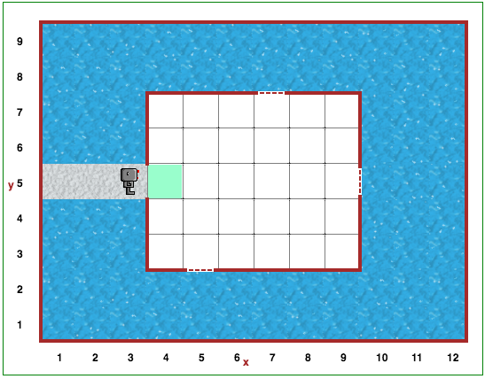

Étape 15: Il va pleuvoir
===============================================

.. reveal:: curriculum_addressed_step_fifteen
    :showtitle: Résultats du programme d'études traités dans cette section. 
    :hidetitle: Cacher les résultat du programme

    - **CS20-CP1** Apply various problem-solving strategies to solve programming problems throughout Computer Science 20.
    - **CS20-CP2** Use common coding techniques to enhance code elegance and troubleshoot errors throughout Computer Science 20.
    - **CS20-FP2** Investigate how control structures affect program flow.

Projet
--------

Ouvrez l’étape 15 de |reeborg_environment|.

Il pleut beaucoup. L'eau entrera par les fenêtres ouvertes à moins que Reeborg ne les ferme. Les fenêtres ouvertes ressemblent à ceci:

Demandez à Reeborg de se déplacer dans la pièce et de fermer les fenêtres à l’aide de la fonction ``build_wall()``. La taille de la pièce et l'emplacement des fenêtres changent constamment.

.. note:: Etant donné que les fenêtres se trouvent à des endroits différents dans chaque monde, assurez-vous que votre solution ne *hard code* pas un certain nombre de pas pour accéder à une fenêtre. Au lieu de cela, Reeborg doit rechercher une fenêtre ouverte alors qu’il se promène dans la maison.

.. |reeborg_environment| raw:: html

   <a href="https://reeborg.cs20.ca/?lang=en&mode=python&menu=worlds/menus/sk_menu.json&name=Step%2015" target="_blank">l'environnement Reeborg</a>