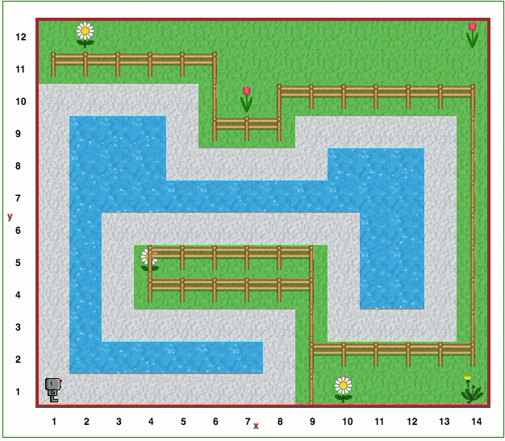

Étape 19: Deuxième promenade autour du lac
===========================================

.. reveal:: curriculum_addressed_step_nineteen
    :showtitle: Résultats du programme d'études traités dans cette section. 
    :hidetitle: Cacher les résultat du programme

    - **CS20-CP1** Apply various problem-solving strategies to solve programming problems throughout Computer Science 20.
    - **CS20-CP2** Use common coding techniques to enhance code elegance and troubleshoot errors throughout Computer Science 20.
    - **CS20-FP2** Investigate how control structures affect program flow.

Projet
--------

Pour le défi suivant, vous devrez utiliser une grande partie des connaissances acquises au cours des étapes précédentes. Vous trouverez peut-être utile de revenir à votre solution de l'étape 14.

Ouvrez l’étape 19 sur |reeborg_environment_extra|.

Reeborg a trouvé un lac beaucoup plus intéressant autour de lequel se promener.

Essayez d’adapter la solution que vous avez faite pour l’étape 14 pour que cela fonctionne avec ce nouveau lac. Reeborg devrait encore une fois poser la banane à la position de départ et continuer à marcher le long du bord du lac (*cette fois-ci sur un chemin en gravier*) jusqu'à ce qu'elle retrouve la banane. Rester le long du mur sera plus difficile cette fois, mais c'est ça le défi!

.. note:: Votre solution pour ce monde devrait également fonctionner dans le monde Step 14!

.. |reeborg_environment_extra| raw:: html

   <a href="https://reeborg.cs20.ca/?lang=en&mode=python&menu=worlds/menus/sk_menu.json&name=Step%2019" target="_blank">l'environnement Reeborg</a>

