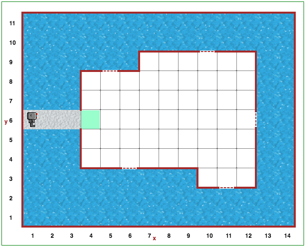

Étape 20: Une autre journée de pluie
========================================

.. reveal:: curriculum_addressed_step_twenty
    :showtitle: Résultats du programme d'études traités dans cette section. 
    :hidetitle: Cacher les résultat du programme

    - **CS20-CP1** Apply various problem-solving strategies to solve programming problems throughout Computer Science 20.
    - **CS20-CP2** Use common coding techniques to enhance code elegance and troubleshoot errors throughout Computer Science 20.
    - **CS20-FP2** Investigate how control structures affect program flow.

Projet
--------

Pour le défi suivant, vous devrez utiliser une grande partie des connaissances acquises au cours des étapes précédentes. Vous trouverez peut-être utile de revenir à votre solution pour l'étape 15.

Ouvrez l’étape 20 sur |reeborg_environment_extra|.

Reeborg doit se déplacer dans la pièce et fermer les fenêtres en utilisant la fonction ``build_wall()``, mais cette fois, la pièce ne sera pas rectangulaire. La forme de la pièce, la taille de la pièce et l'emplacement des fenêtres changent constamment.

Pour vous aider à résoudre ce problème, posez-vous la question suivante. Imaginez que Reeborg se tient près d'un mur, fasse un pas en avant et constate qu'il n'y a plus de mur à côté de lui. Que peut-il arriver si Reeborg fait un pas de plus? **Indice: il y a deux possibilités.**

.. |reeborg_environment_extra| raw:: html

   <a href="https://reeborg.cs20.ca/?lang=en&mode=python&menu=worlds/menus/sk_menu.json&name=Step%2020" target="_blank">l'environnement Reeborg</a>

