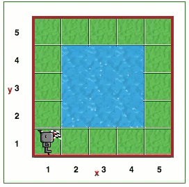

Etape 3: tourner à gauche et passer à travers le code en étapes
=================================================================

.. reveal:: curriculum_addressed_etape_3
    :showtitle: Résultats du programme d'études traités dans cette section. 
    :hidetitle: Cacher les résultat du programme

    - **20IN-PT.1** Appliquer diverses stratégies de résolution de problèmes pour résoudre des problèmes de programmation dans le cours d’Informatique 20.
    - **20IN-PT.2** Se servir de techniques de codage courantes pour améliorer l’élégance de son code et rechercher les causes d’erreurs.

Didacticiel-*Tutorial*
-----------------------

Les Bug de Reeborg
~~~~~~~~~~~~~~~~~~~

Dans le jargon informatique, un Bug est une erreur qui provoque le comportement d'un programme de manière inattendue. Si vous écrivez des programmes informatiques, c’est garantie vous allez avoir des Bugs à un moment ou un autre. Les bons programmeurs cherchent à "supprimer" les bugs ou les "corriger" dès qu'ils trouvent que leur programme se composent de façon inattendue.

de moins bon programmeurs affirment que des «Bugs» ne sont pas vraiment des Bugs, mais qu'ils sont des «caractéristiques» de leurs programmes. **Vous** allez être un bon programmeur, contrairement au fabricant de Reeborg, dont le programme est jonché de bugs. Certains des problèmes avec Reeborg sont:

#. Reeborg a une fuite d'huile. Les fuites d'huile sont nuisibles pour l'environnement et incommode pour Reeborg qui doit reconstituer ses approvisionnements quand il n'est pas occupé à accomplir des tâches. Le fabricant de Reeborg prétend que c'est une caractéristique, car il vous permet de suivre le chemin de Reeborg, comme tout programmeur peut apprendre à «tracer» un programme.
#. Le mécanisme de contrôle de direction de Reeborg n'est pas manipulé correctement par le programme de Reeborg: il  peut seulement tourner à gauche. Le fabricant de Reeborg, une fois de plus, prétend que c'est une caractéristique car il vous présente une occasion d'apprendre sur les **fonctions**. Vous apprendrez bientôt comment programmer une solution de contournement, permettant à Reeborg de tourner à droite, bien que d'une manière gaspilleuse.
#. Reeborg a une boussole, lui permettant de déterminer dans quelle direction elle est orientée. Malheureusement, encore une fois, le programme qui permet à Reeborg d'obtenir les informations de la boussole a un Bug: il vérifie seulement si Reeborg fait face au nord... ou non. Une fois de plus, vous apprendrez bientôt comment implémenter une solution de contournement.
#. Reeborg peut voir si un mur est en face de lui, et peut aussi tourner sa tête vers la droite pour voir s'il ya un mur là-bas. Cependant, un "glitch" (qui est un autre terme que les fabricants de logiciels utilisent pour éviter d'avoir à dire que leur produit a un Bug) empêche le programme de reeborg d'enregistrer correctement un mur quand il tourne sa tête à gauche.

.. index:: debugging

Passer à travers le code en étapes-*Stepping Through Code*
~~~~~~~~~~~~~~~~~~~~~~~~~~~~~~~~~~~~~~~~~~~~~~~~~~~~~~~~~~~

Parfois, pour trouver la cause des bugs, il peut briser le flux normal du programme. À cette fin, vous pouvez effectuer une ou plusieurs des opérations suivantes:

#. Vous pouvez *suspendre* un programme en cours d'exécution en appuyant sur le bouton **pause**. Ceci est similaire à ce que les gens appellent “breakpoint” dans un programme d'ordinateur

   |pauseButton|

#. Au lieu d'appuyer sur le bouton pause, vous pouvez taper l'instruction ``pause()`` à n'importe quel point à l'intérieur d'un programme et Reeborg s'arrête, en attendant votre permission de continuer.

#. Vous pouvez parcourir un programme, *une instruction à la fois*, en appuyant sur le bouton *exécuter une instruction et pause* ou le bouton **étape**. Par défaut, la prochaine ligne à exécuter est surligné; vous pouvez désactiver la mise en surbrillance en cliquant sur un bouton au-dessus de l'éditeur de code.

   |stepButton|

#. Vous pouvez arrêter un programme à tout moment en appuyant sur le bouton **Stop**; cela peut malheureusement ne pas fonctionner si vous créez ce qui est connu comme une boucle infinie, en dehors du contrôle de Reeborg. Au pire, vous pouvez toujours juste actualiser la page web

   |stopButton|

.. |stepButton| image:: images/step_button.png

À ton tour
------------

Ouvrez l'étape 3 sur |reeborg_environment|.

Comme mentionné ci-dessus, Reeborg peut seulement tourner dans une direction: à gauche. Pour dire à Reeborg de tourner, vous pouvez utiliser la commande ``turn_left()``.

Utilisez la fonction  ``move()`` et la fonction ``turn_left()`` pour faire Reeborg marcher autour du lac.

.. topic:: Essaie ça!

    Pour voir ce qui se passe, faisons certaines choses intentionnellement mal. Par exemple, faire Reeborg marcher dans le lac. Vous pourriez également vouloir essayer de ne pas marcher tout le chemin autour du lac pour voir ce que le message d'erreur sera.

.. |reeborg_environment| raw:: html

   <a href="https://reeborg.cs20.ca/?lang=en&mode=python&menu=worlds/menus/sk_menu.json&name=Step%203" target="_blank">l'environnement Reeborg</a>