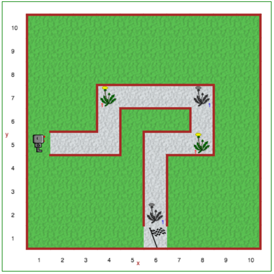

Étape 4: Commentaires
==================================

.. important::

     Ecrivez vos programmes informatiques pour les rendre faciles pour **autres personnes** à lire et comprendre.

.. reveal:: curriculum_addressed_etape_4
    :showtitle: Résultats du programme d'études traités dans cette section. 
    :hidetitle: Cacher les résultat du programme

    - **20IN-PT.1** Appliquer diverses stratégies de résolution de problèmes pour résoudre des problèmes de programmation dans le cours d’Informatique 20.
    - **20IN-PT.2** Se servir de techniques de codage courantes pour améliorer l’élégance de son code et rechercher les causes d’erreurs.

.. index:: comments

Didacticiel-*Tutorial*
-----------------------

Lorsque vous écrivez des programmes, vous devez les écrire de sorte que d’autres personnes, tout comme vous, les trouvent faciles à lire et puissent comprendre ce qu’elles font. Oui, les langages informatiques sont conçus pour vous permettre de communiquer avec des ordinateurs, tout comme les langages humains ont évolué pour permettre aux humains de communiquer les uns avec les autres. Mais les langages informatiques, beaucoup plus simples que les langages humains, sont souvent utilisés par les programmeurs pour partager leur travail avec d’autres programmeurs.

Les commentaires sont des notes prises par un programmeur qui sont ignorées par l'ordinateur. Ils sont destinés à être lus et compris uniquement par les humains. Ils permettent aux programmeurs d’écrire des programmes plus faciles à comprendre pour d’autres personnes.

Lorsque vous utilisez Python, vous pouvez écrire des commentaires de deux manières:

- En mettant un ``#`` avant un commentaire sur une ligne donnée.
- En mettant toute quantité de texte (même s’il occupe plus d’une ligne) entre guillemets tels que ``""" ... """`` ou ``''' ... '''``.

Je vais d’abord écrire un programme simple sans aucun commentaire suivi d’une deuxième version avec commentaires ajoutés; Cependant, je ferai la même erreur dans les deux programmes. Pouvez-vous le repérer plus facilement dans le premier programme ou le second?

.. code-block:: python

    move()
    move()
    turn_left()
    put()
    move()
    move()
    turn_left()
    put()
    move()
    turn_left()
    put()
    move()
    move()
    turn_left()
    put()

Comparez le programme ci-dessus au même programme, du point de vue de Reeborg, mais avec des commentaires ajoutés pour les humains; vous pourrez reconnaître les commentaires tels qu’ils apparaissent dans une couleur et un style de police différents.

.. code-block:: python

    '''  Voici un exemple d'un
    programme simple dans lequel Reeborg dessine un carré,
    il laisse également un objet dans chaque coins. '''

    move()  # les commandes Python sont sur des lignes séparées
    move()
    turn_left() # Reeborg sais seulement tourner à gauche
    put()  # nous présumons que Reeborge a assez d'objet pour mettre dans chaque coins

    # nous répétons le code ci-dessus trois autres fois pour compléter le carré.
    move()
    move()
    turn_left()
    put()

    move()
    turn_left()
    put()

    move()
    move()
    turn_left()
    put()

Les commentaires ci-dessus ne sont pas particulièrement pertinants, mais au moins un d’eux aurait dû vous aider à trouver ce qui clochait dans le programme. Vous pourriez penser que c'est tricher; cependant, comment pouvez-vous deviner l’intention qui se cache derrière certaines lignes de code dans un programme? L'ajout de commentaires expliquant ce qu'un programme donné devrait faire peut être très utile pour rechercher des erreurs.

Notez qu'en plus des commentaires, j'ai utilisé des lignes vides (souvent appelées *whitespace*) pour séparer certains blocs de code "logiques", afin de mieux voir le patron. Ensemble, l'utilisation de commentaires et l'insertion de lignes vides peuvent faciliter la lecture d'un programme.

À ton tour
------------

Ouvrez l'étape 3 sur |reeborg_environment|.

Utilisez les fonctions que nous avons apprises jusqu'à maintenant pour que Reeborg marche sur le chemin du gravier, qu'il saisisse les pissenlits à mesure qu'il les trouve et les dépose dans des poubelles bien placées (*représentées par des images de pissenlits gris*). Utilisez la fonction ``pause`` pour que Reeborg attende à chaque endroit où il trouve un pissenlit à rammasser. Veillez à utiliser les commentaires et les espaces vide pour augmenter la lisibilité de votre solution!

Rappelons que les fonctions discutées jusqu’à présent incluent:

-  ``move()``
-  ``turn_left()``
-  ``take()``
-  ``put()``
-  ``pause()``

.. |reeborg_environment| raw:: html

   <a href="https://reeborg.cs20.ca/?lang=en&mode=python&menu=worlds/menus/sk_menu.json&name=Step%204" target="_blank">l'environnement Reeborg</a>