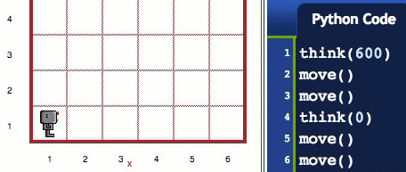
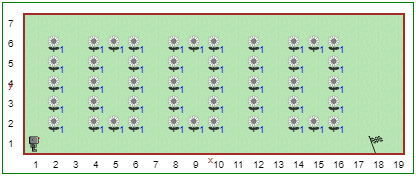

Étape 7: Bonne fête Reeborg et la fonction think()
======================================================

.. reveal:: curriculum_addressed_step_seven
    :showtitle: Résultats du programme d'études traités dans cette section. 
    :hidetitle: Cacher les résultat du programme

    - **20IN-PT.1** Appliquer diverses stratégies de résolution de problèmes pour résoudre des problèmes de programmation dans le cours d’Informatique 20.
    - **20IN-PT.2** Se servir de techniques de codage courantes pour améliorer l’élégance de son code et rechercher les causes d’erreurs.
    - **20IN-FP.3** Construire et utiliser des fonctions pour créer des éléments de code réutilisables.

Didacticiel-*Tutorial*
-----------------------

Vous avez peut-être remarqué que Reeborg prends du temps entre chaque commande; c'est parce qu'il doit "réfléchir" à ce que vous lui demandez de faire. Cependant, on peut changer le temps que Reeborg met à réfléchir en utilisant la fonction ``think ()`` avec un argument (quelque chose entre les ``()``), comme ceci:

.. code-block:: python

    think(500)

Le nombre ``500`` qui apparaît entre les parenthèses est ce que nous appelons un *argument* d'une fonction. Plus le nombre est petit, moins Reeborg prendra de temps avant de considérer chaque action. Une valeur de 1000 signifie que Reeborg met environ 1 seconde à réfléchir. Parfois, Reeborg a quelque chose à penser dont vous n'êtes pas au courant, alors il peut parfois sembler penser plus longtemps que prévu. L'appel de ``think (0)`` dit à Reeborg d'agir aussi vite que possible.

À ton tour
-----------

Ouvrez l'étape 7 sur |reeborg_environment|.

Reeborg vient d'avoir 18 ans et veut que tout le monde dans l'univers le sache. Reeborg pense que ce serait une blague amusante de planter des fleurs devant sa maison pour célébrer. Reeborg est un robot et ne connaît que le binaire, et 18 est représenté par 10010 en binaire.

Définissez ces nouvelles fonctions:

- ``draw_one()`` planter les fleurs en forme de 1
- ``draw_zero()`` planter les fleurs en forme de 0

Utilisez les fonctions que vous avez créées pour planter le message d'anniversaire de Reeborg. Chaque instruction doit positionner et orienter correctement Reeborg pour le chiffre suivant. Veillez utiliser les commentaires et les espaces vide pour augmenter la lisibilité de votre solution!

.. |reeborg_environment| raw:: html

   <a href="https://reeborg.cs20.ca/?lang=en&mode=python&menu=worlds/menus/sk_menu.json&name=Step%207" target="_blank">l'environnement Reeborg</a>