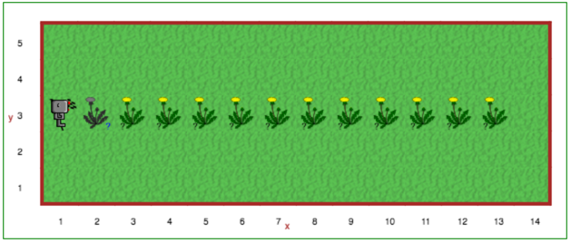

Étape 8: poser des questions
=======================================

.. reveal:: curriculum_addressed_step_eight
    :showtitle: Résultats du programme d'études traités dans cette section. 
    :hidetitle: Cacher les résultat du programme

    - **CS20-CP1** Apply various problem-solving strategies to solve programming problems throughout Computer Science 20.
    - **CS20-CP2** Use common coding techniques to enhance code elegance and troubleshoot errors throughout Computer Science 20.
    - **CS20-FP2** Investigate how control structures affect program flow.
    - **CS20-FP3** Construct and utilize functions to create reusable pieces of code.

.. index:: if

Didacticiel-*Tutorial*
-----------------------

Parfois, nous ne savons pas à l'avance ce à quoi ressemblera le monde dans lequel Reeborg se trouvera. Heureusement, Reeborg peut percevoir le monde qui l’entoure et nous pouvons lui poser des questions. Pour poser une question à l'ordinateur, nous utilisons une instruction ``if`` ou *si*. Cette **déclaration/*statement*** ``if`` ou *si* suit un schéma similaire à celui de ``function``\ s :

.. code-block:: python

    def un_nom():
        # bloc de code

    if une_condition:
        # bloc de code

.. note::

    Le terme général utilisé pour décrire une fonction qui donne un résultat équivalent à ``Vrai`` ou ``Faux`` dans une instruction ``if`` (*si*) est **condition**::

       if condition:
           ...

Devoir spécifier ``Vrai`` ou `` Faux`` n'aide pas Reeborg à décider par lui-même. Cependant, il existe des fonctions spéciales reconnues par Reeborg qui lui permettent de prendre des décisions. Le premier d'entre eux est ``object_here ()`` qui indique à Reeborg s'il y a au moins un objet à la position de la grille où il se trouve. Par exemple, si nous voulons demander à Reeborg de rammasser des objets (pissenlits, carottes, etc.), une partie du code pourrait être::

    if object_here():
        take()

La liste complète des fonctions (*questions*) auxquelles Reeborg peut répondre est la suivante:
    
    ===================  ============
    Question/Function    Explication
    ===================  ============
    at_goal ()           Renvoie la valeur Vrai si Reeborg se trouve sur une tuile de but (drapeau, maison ou case verte), Faux sinon.
    front_is_clear ()    Renvoie Vrai s'il n'y a pas d'obstacle (mur, etc.) devant Reeborg, Faux sinon.
    right_is_clear ()    Renvoie Vrai s'il n'y a pas d'obstacle (mur, etc.) à droite de Reeborg, Faux sinon.
    wall_in_front ()     Renvoie Vrai s'il y a un mur devant Reeborg, Faux sinon.
    wall_on_right ()     Renvoie Vrai s'il y a un mur du côté droit de Reeborg, Faux sinon.
    object_here ()       Renvoie Vrai s'il y a un objet (étoile, pissenlit, etc.) sur la même tuile sur laquelle Reeborg est debout, Faux sinon.
    carries_object ()    Renvoie Vrai si Reeborg porte actuellement au moins un objet (étoile, pissenlit, etc.). Renvoie Faux si Reeborg ne porte rien.
    is_facing_north ()   Renvoie Vrai si Reeborg fait actuellement face au nord, Faux sinon.
    ===================  ============

.. .. admonition:: For educators
..
..     The function ``object_here()`` returns a list of object types (as strings)
..     found at a given location.  For example, if there are stars and dandelions
..     at the same location, ``object_here()`` could return ``["star", "dandelion"]``
..     or ``["dandelion", "star"]``. If no object is present, an empty list is
..     returned.  As you likely already know, Python treats an empty list as
..     being equivalent to ``False`` in an ``if`` statement, and a non-empty
..     list as equivalent to ``True``.
..
..     If many objects could potentially be found in a given world, and we
..     are interested in only one object type, we can specify it as a function
..     argument::
..         if object_here("dandelion"):
..             take("dandelion")
..
..     ``object_here("dandelion")`` will either return an empty list or the list
..     ``["dandelion"]``.

À ton tour
-----------

Ouvrez l'étape 8 sur |reeborg_environment|.

L'ami de Reeborg, Bree, aime cueillir les pissenlits et souffler les graines aussi loin qu'elle peut. Pour cette raison, Reeborg trouve souvent des pissenlits qui poussent dans la cour avant. Les pissenlits ne sont pas toujours au même endroit, cependant. Pour voir cela, appuyez sur le bouton de lecture du monde Étape 8 et remarquez que les pissenlits apparaissent à des endroits différents à chaque fois. *Vous pouvez déduire que cela va arriver à cause du point d'interrogation noir sous l'image du pissenlit*.

Créez un programme pour que Reeborg traverse la cour avant, ramassant un pissenlit chaque fois qu'il en trouve un. Il peut y avoir un pissenlit dans n'importe quels cases avec une image de pissenlit avec un point d’interrogation en dessous (*vous pouvez le voir à nouveau si vous appuyez sur le bouton de rechargement*). Vous devrez poser des questions à Reeborg lorsqu’il se déplace dans le jardin. Une fois que tous les pissenlits sont ramassés, demandez à Reeborg de poser tous les pissenlits ramassés à (2,3), puis de revenir au drapeau (1,3). N'oubliez pas d'utiliser les commentaires et les espaces pour augmenter la lisibilité de votre solution!

Si vous avez des problèmes (voici une explication plus détaillée)
------------------------------------------------------------------

.. code-block:: python

    if Vrai:
        move()

    if Faux:
        turn_left()

Dans le code ci-dessus, ``if``, ``Vrai`` et ``Faux`` sont tous des mots-clés Python. C'est une bonne idée d'essayer le code ci-dessus dans le monde de Reeborg (vous pouvez utiliser n'importe quel monde, peut-être tout seul?). Vous pouvez également vouloir échanger les valeurs Vrai et Faux, puis réexécutez le programme pour voir ce qui se passe.

Lorsqu'on a présenté les fonctions, on a expliqué que **l’appel** à une fonction était équivalent à l’insertion du bloc de code correspondant à la définition de la fonction dans le programme. Donc::

    move()
    turn_right()  # function call
    move()

est équivalent à::

    move()
    # début du block de code dans turn_right()
    turn_left()
    turn_left()
    turn_left()
    # fin du bloc de code
    move()

On peut voir les déclarations ``if`` de façon similaires, sauf que nous avons une insertion *conditionnelle* (ou plutôt **suppression**!). Donc::

    move()
    if True:
        turn_left()
        turn_left()
    move()

est équivalent à::

    move()
    turn_left()
    turn_left()
    move()

tandis que::

    move()
    if False:
        turn_left()
        turn_left()
    move()

est équivalent à::

    move()
    move()

Notez que penser de cette façon ne signifie pas qu'une telle suppression serait faite de manière permanente: si, d'une manière ou d'une autre, notre programme *revenait dans une boucle* et répétait cette partie du code à nouveau, l'instruction ``if`` serait réévaluée à chaque fois pour décider d'exécuter ou non les lignes de code à l’intérieur du bloc de code.

Nous pouvons représenter ce qui précède à l'aide d'un organigramme/*flowchart*:

.. figure:: images/flowcharts/if.jpg
   :align: center

.. |reeborg_environment| raw:: html

   <a href="https://reeborg.cs20.ca/?lang=en&mode=python&menu=worlds/menus/sk_menu.json&name=Step%208" target="_blank">l'environnement Reeborg</a>