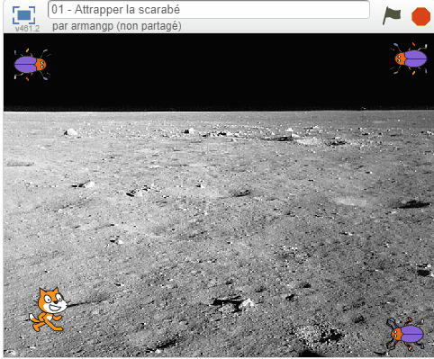

.. qnum::
   :prefix: project-two
   :start: 1

Projet 2: attraper le scarabée (*the beetle*)
======================================================

.. topic:: Aperçu rapide du projet

    Vous avez options pour le premier projet qui vous accordera une note par rapport à la difficulter de l'option et de la qualité de votre programme.

Instructions 
-------------

.. reveal:: Instructions_for_project_two
    :showtitle: Instructions pour avoir 85%
    :hidetitle: Cacher instructions pour avoir 85%
    
    **Instructions pour avoir 85%**
    
    Créez un programme où vous pouvez déplacer Scratch le Chat autour de la scène avec les touches fléchées.
    Un deuxième sprite (le scarabée) devrait être inclus et doit rebondir continuellement sur la scène. Le but de ce petit jeu sera de déplacer Scratch pour que le chat touche le second sprite. Les fonctionnalités suivantes doivent être implémentées pour obtenir les notes maximales:

        - Scratch le Chat se déplace autour de la scène en appuyant sur les touches fléchées.
        - La musique de fond doit jouer pendant que le jeu est actif (une fois le drapeau vert enfoncé)
        - Chaque fois que le scarabée frappe le côté de la scène, un effet sonore doit être joué.
        - Lorsque Scratch atteint le scarabée:
            - Scratch devrait dire "je vous ai eu!"
            - Le scarabé devrait être placée au hasard à un nouvel emplacement et dire "Pas cette fois!", Puis reprendre son mouvement.
        - Une touche de la barre d'espace devrait mettre le scarabée dans «Mode Pepsi». Lorsque vous appuyez sur la barre d'espace, le scarabée doit se déplacer plus rapidement et se voir appliquer un effet d'image / couleur. Lorsque la barre d'espace est relâchée, son mouvement et son apparence devraient revenir à la normale.
        
    .. note:: le bloc de l'onglet *Capteurs* ``TOUCHÉ?`` peut faire référence à un autre sprite sur la scène ou au bord de la scène.

.. this is the gif to show what the program should do.
.. enlève les .. devant ceci et remplace le 'source path' par celui de la bonne photo

.. Votre programme pour avoir 85% devrait ressembler à ceci:

.. .. image:: images/scratch_catch_the_beetle_expert.gif

.. reveal:: extra_for_experts_two
    :showtitle: Instructions pour avoir 100%
    :hidetitle: Cacher instructions pour avoir 100%
    
    **Instructions pour avoir 100%**

    Les différences entre les premières instructions sont en **gras**
    
    Créez un programme où vous pouvez déplacer Scratch le Chat autour de la scène avec les touches fléchées.
    Un deuxième sprite (le scarabée) devrait être inclus et doit rebondir continuellement sur la scène. Le but de ce petit jeu sera de déplacer Scratch pour que le chat touche le second sprite. Les fonctionnalités suivantes doivent être implémentées pour obtenir les notes maximales:

        - Scratch le Chat se déplace autour de la scène en appuyant sur les touches fléchées.
        - La musique de fond doit jouer pendant que le jeu est actif (une fois le drapeau vert enfoncé).
        - Chaque fois que le scarabée frappe le côté de la scène, un effet sonore doit être joué.
        - **Le scarabé devrait se déplacer en utilisant un algorithme de "randonneur aléatoire":**
        - **Chaque fois que le scarabée se déplace, il doit choisir l'une des trois options suivantes:**
            - **Tourner à droite (~ 15) et aller de l'avant**
            - **Tourner à gauche (~ 15) et aller de l'avant**
            - **Simplement avancer**
        - Lorsque Scratch atteint le scarabée:
            - Scratch devrait dire "je vous ai eu!"
            - **Le scarabée devrait dire "Tu m’as eu!" et disparaitre.**
        - Une touche de la barre d'espace devrait mettre le scarabée dans «Mode Pepsi». Lorsque vous appuyez sur la barre d'espace, le scarabée doit se déplacer plus rapidement et se voir appliquer un effet d'image / couleur. Lorsque la barre d'espace est relâchée, son mouvement et son apparence devraient revenir à la normale.
        - **Ajouter une fonctionnalité où l'utilisateur peut appuyer sur la touche "r" pour retourner instantanément le scarabée à l'origine.**
        - **Une fois que votre scarabé fonctionne comme il devrait, dupliquez-le pour avoir 3 sprites de scarabées distinctes qui commencent à des emplacements différents. Quand Scratch attrape un scarabée, Scratch dit "je vous ai eu!" et le scarabée devrait dire "Tu m’as eu!" et disparaissent.**
        
    .. note:: le bloc de l'onglet *Capteurs* ``TOUCHÉ?`` peut faire référence à un autre sprite sur la scène ou au bord de la scène.
    

.. this is the gif to show what the program should do.

Votre programme pour avoir 100% devrait ressembler à ceci:

Lorsque vous avez terminé, appuyez sur le bouton **PARTAGER** de l'éditeur et soumettez l'URL de ce projet.

Évaluation
-----------

.. reveal:: eval_eighty_five_project_two
    :showtitle: Évaluation pour avoir 85%
    :hidetitle: Cacher l'évaluation pour avoir 85%
    +--------------------------------------------------------------------------------------------------------------------------------+------+-------------+--------------+
    | Critère                                                                                                                        | oui  | non (-10%)  | un peu (-5%) |
    +================================================================================================================================+======+=============+==============+
    | La musique de fond jouer pendant que le jeu est actif                                                                          |      |             |              |
    +--------------------------------------------------------------------------------------------------------------------------------+------+-------------+--------------+
    | Scratch dit "je vous ai eu!" et le scarabé saute et dit "Pas cette fois!" quand ils se touchent                                |      |             |              |
    +--------------------------------------------------------------------------------------------------------------------------------+------+-------------+--------------+
    | Le “Mode Pepsi” est fonctionnelle lorsqu’on presse la barre d’espace et retourne à la norme quand la barre d’espace est pressé.|      |             |              |
    +--------------------------------------------------------------------------------------------------------------------------------+------+-------------+--------------+
    | le scarabée rebondis et fait un son quand il touche le côté de l’écran                                                         |      |             |              |
    +--------------------------------------------------------------------------------------------------------------------------------+------+-------------+--------------+
    

.. reveal:: eval_one_hundy_project_two
    :showtitle: Évaluation pour avoir 100%
    :hidetitle: Cacher l'évaluation pour avoir 100%

    +-------------------------------------------------------------------------------------------------------------------------------------------------------+------+-------------+-------------+
    | Critère                                                                                                                                               | oui  | non (-10%)  | un peu (-5%)|
    +=======================================================================================================================================================+======+=============+=============+
    | La musique de fond jouer pendant que le jeu est actif                                                                                                 |      |             |             |
    +-------------------------------------------------------------------------------------------------------------------------------------------------------+------+-------------+-------------+
    | Scratch le Chat se déplace autour de la scène en appuyant sur les touches fléchées.                                                                   |      |             |             |
    +-------------------------------------------------------------------------------------------------------------------------------------------------------+------+-------------+-------------+
    | Il y a 3 scarabées qui commence à de différentes endroits                                                                                             |      |             |             |
    +-------------------------------------------------------------------------------------------------------------------------------------------------------+------+-------------+-------------+
    | L’algorithme de "randonneur aléatoire" fonctionne pour les trois scarabée                                                                             |      |             |             |
    +-------------------------------------------------------------------------------------------------------------------------------------------------------+------+-------------+-------------+
    | L’utilisateur appuis sur le “r” pour remettre les scarabées à l’origine.                                                                              |      |             |             |
    +-------------------------------------------------------------------------------------------------------------------------------------------------------+------+-------------+-------------+
    | Scratch dit "je vous ai eu!" et le scarabée dit “tu m’as eu” et disparaît quand ils se touchent                                                       |      |             |             |
    +-------------------------------------------------------------------------------------------------------------------------------------------------------+------+-------------+-------------+
    | Le “Mode Pepsi” est fonctionnelle pour les 3 scarabées lorsqu’on presse la barre d’espace et retourne à la norme quand la barre d’espace est relâché  |      |             |             |
    +-------------------------------------------------------------------------------------------------------------------------------------------------------+------+-------------+-------------+
    

