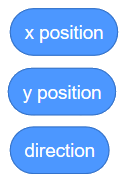
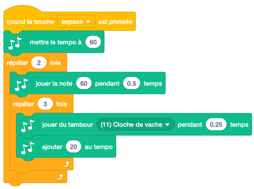
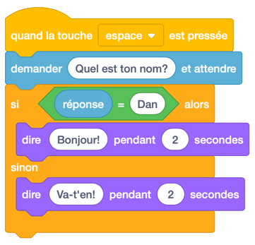
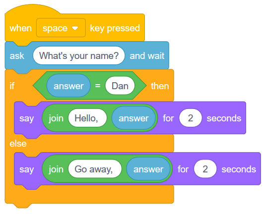
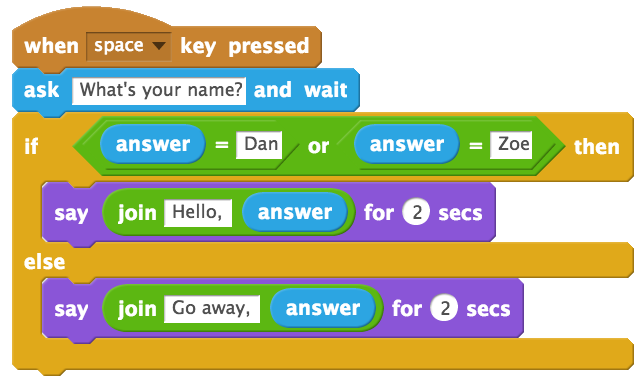
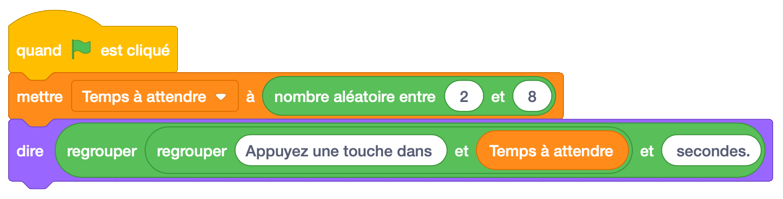
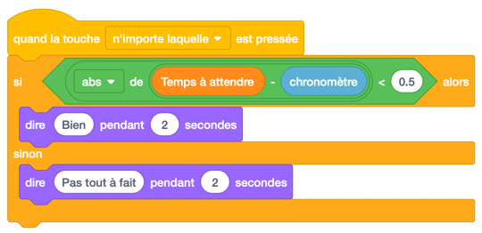

.. qnum::
   :prefix: scratch-variables
   :start: 1

Variables intégrées (tempo, réponse et minuterie)
==================================================

.. topic:: Aperçu rapide de la journée

    Explorez certaines des variables intégrées disponibles dans Scratch, notamment **tempo**, **answer** et **timer**. Présenter l'opérateur **join** pour enchaîner des chaînes et l'opérateur **abs** pour calculer la valeur absolue d'un nombre.

.. reveal:: curriculum_addressed_built_in_var
    :showtitle: Résultats du programme d'études traités dans cette section. 
    :hidetitle: Cacher les résultat du programme

    - **20IN-PT.1** Appliquer diverses stratégies de résolution de problèmes pour résoudre des problèmes de programmation dans le cours d’Informatique 20.
    - **20IN-FP.1** Se servir de différents types de données, y compris entier, virgule flottante, booléen et chaine pour résoudre des problèmes de programmation.
    - **20IN-FP.2** Faire des recherches sur la manière dont les structures de contrôle affectent le déroulement du programme.

Si vous préférez regarder une vidéo, la `vidéo <https://www.youtube.com/watch?v=bguswVWu2kY>`_ suivante montre les mêmes idées que celles que j'ai décrites dans le texte ci-dessous.

.. youtube:: bguswVWu2kY
    :height: 315
    :width: 560
    :align: left
    :http: https

Identifier les variables intégrées
------------------------------------

Nous avons utilisé des variables pour tenir compte des valeurs qui changent tout au long de notre programme. Lorsque nous avons créé le jeu d’esquive, nous avons créé une variable pour la vitesse du ballon de basket et la vitesse du melon d'eau, car les deux sprites ont changé de vitesse tout au long du jeu. Pouvoir créer nos propres variables est incroyablement puissant, mais pour certaines choses, Scratch nous fournit des variables intégrées que nous pouvons utiliser. Lorsque nous créons une variable, nous pouvons l'utiliser en faisant glisser un bloc à partir de l'onglet **Données** qui ressemble à ceci:

Si nous regardons à travers les onglets de blocs, nous pouvons trouver de nombreux autres blocs similaires. Par exemple, dans l'onglet **Mouvement**, nous trouvons trois variables intégrées:

Tout au long de cette section, nous explorerons certaines des variables intégrées disponibles dans Scratch.

Tempo
-------------

.. note::

	Pour permettre à votre personnage de Scratch d'accéder à l'onglet **Musique**, vous devrez cliquer sur le bouton "Ajouter des extensions" (en bas à gauche de l'écran), puis sur le bouton Musique.

  .. image:: images/scratch_add_extension.png

L'une des variables intégrées que Scratch nous permet d'utiliser est une variable de **tempo**. Vous pouvez le trouver dans l'onglet *Musique*. Pour afficher le temp sur la scène, vous pouvez cocher la case en regard du nom de la variable dans l'onglet Musique. Nous pouvons soit définir le **tempo** sur un nombre spécifique de bpm (battements par minute), soit le modifier légèrement. Considérons le code ci-dessous:

Avant d’exécuter ce code vous-même, essayez de déterminer quelle sera la valeur du tempo une fois le code exécuté. Vous pouvez voir que le tempo sera réinitialisé à 60 bpm au début du code, puis nous le modifierons dans la boucle imbriquée de 20 bpm. Combien de fois le "changement de tempo de 20 blocs" sera-t-il appelé? Puisqu'il y a un bloc repeat 3 dans un block repeat 2, le bloc "change de tempo" sera appelé 6 fois. Nous pouvons donc déterminer que la valeur du tempo une fois le code exécuté sera de 180 bpm (puisqu'il faut ajouter 20 bpm 6 fois).

Vérifie ta compréhension
~~~~~~~~~~~~~~~~~~~~~~~~~

.. fillintheblank:: scratch_tempo_check

    Quelle serait la valeur du tempo si nous déplacions le bloc "ajouter 20 au tempo" comme indiqué?

        .. image:: images/scratch_tempo_variable.png
         
          - : 100: Oui! Puisque nous répétons le bloc 'ajouter 20 au tempo' 2 fois, nous devons ajouter 40 bpm à la valeur d'origine.
            : 180: Non. Le bloc 'ajouter 20 au tempo' ne se trouve pas dans la boucle imbriquée, nous ne le répétons donc que 2 fois
            :.*: Réessayer! Puisque nous répétons le bloc 'ajouter 20 au tempo' 2 fois, nous devons ajouter 40 bpm à la valeur d'origine.

Réponse
-------------

Si nous voulons obtenir des informations de l'utilisateur, Scratch nous fournit un bloc utile "Demander * et attendre" que vous pouvez trouver dans l'onglet **Capteurs**. Nous pouvons réagir à la saisie de l'utilisateur en vérifiant s'il a entré une certaine valeur. Par exemple, dans le script ci-dessous, nous lançons *Bonjour* si l'utilisateur entre le nom **Dan** et *Va-t'en!* sinon.

Nous pouvons améliorer le script ci-dessus en utilisant le "bloc de regrouper", que vous pouvez trouver dans l'onglet **Opérateurs**. Le bloc de regroupements nous permet d’écarter deux choses (souvent appelées concaténation dans le langage informatique). Si nous utilisons le bloc de regroupements de la manière suivante, nous pouvons dire "Bonjour, Dan" ou "Va-t'en, quelqu'un", où quelqu'un sera le nom que l'utilisateur a entré.

Si nous souhaitons autoriser plusieurs noms à déclencher le message Hello, nous pouvons utiliser le bloc "ou" présent dans l'onglet **Opérateurs**. Cela nous permet de vérifier plus d'une condition. Le script ci-dessous va dire bonjour à Dan ou à Zoé, mais dit de partir à quelqu'un d'autre.

Minuteur
---------

Créons un jeu simple dans lequel l’utilisateur doit essayer d’appuyer sur une touche après un certain nombre de secondes. Si l'utilisateur est proche, félicitez-le. S'ils ne sont pas proches, dites-leur de réessayer.

Puisque nous ne voulons pas que le temps d’attente soit toujours le même, nous devons créer une variable que nous pouvons utiliser à la place d’un nombre spécifique. Après avoir créé la variable, demandez à l’ordinateur de choisir un nombre aléatoire à utiliser pendant le temps d’attente et indiquez à l’utilisateur combien de temps il doit attendre.

Pour afficher la variable de minuterie intégrée sur la scène, ouvrez l'onglet **Capteurs** et cochez la case de la variable de minuterie. Bien que vous ne souhaitiez pas que le chronomètre apparaisse sur la scène dans la version finale du jeu, cela peut être utile lors de la création du jeu. Notez que chaque fois que vous cliquez sur le drapeau, le chronomètre revient à 0. Si vous voulez commencer le jeu en utilisant un autre moyen que le drapeau sur lequel vous cliquez, vous pouvez utiliser le bloc "Réinitialiser le chronomètre" de l'onglet **Capteurs**.

Afin de déterminer si l'utilisateur est "suffisamment proche" du temps d'attente, nous devons considérer ce qui se passe s'ils sont légèrement au-dessus ou légèrement en dessous du temps d'attente. Par exemple, supposons que le temps d'attente était supposé être de 5 secondes. Nous aimerions que l'utilisateur "gagne" s'il appuie sur une touche moins d'une demi-seconde du temps d'attente. Si l'utilisateur appuie sur la touche une demi-seconde **trop tard**, à 5,5 secondes, on peut simplement soustraire la valeur de la minuterie du temps d'attente:

.. math::
    5.5 - 5 = 0.5

Cependant, si l'utilisateur appuie sur la touche une demi-seconde **trop tôt** et que nous effectuons la même soustraction, nous obtiendrons un nombre négatif:

.. math::
    4.5 - 5 = -0.5

Ce que nous aimerions vraiment faire est simplement demander si le temps cliqué est inférieur à une demi-seconde du temps d’attente prévu. Pour ce faire, nous devons convertir la réponse négative ci-dessous en une valeur positive. En classe de maths, vous avez appris une opération utile qui permet précisément cela: la valeur absolue

.. math::
    \left | 5.5-5 \right | = 0.5

.. math::
    \left | 4.5-5 \right | = 0.5

Nous pouvons utiliser la valeur absolue dans Scratch pour déterminer la distance (toujours positive) du chronomètre à partir du temps d'attente. Vous trouverez l'opérateur de valeur absolue dans l'onglet **Opérateurs**, il ressemblera à ceci (**abs de ()** en français):

Assurez-vous que l'opérateur absolut soit sélectionné *abs*, qui est l'abréviation de valeur absolue. Nous pouvons maintenant créer un code qui s'exécute lorsqu'une touche est enfoncée et vérifie si l'utilisateur a appuyé sur une touche moins d'une demi-seconde avant ou après le délai d'attente prévu.

.. note:: Une extension intéressante de ce jeu consiste à ce que le jeu indique à l'utilisateur à quelle distance il se trouvait du temps d'attente prévu. Si vous faites cela dans un bloc "dire" séparé *après* les blocs "Bien" ou "Pas tout à fait", vous devrez peut-être créer une autre variable pour savoir quand la touche a été enfoncée.

Practice Problem
-----------------

Work on your current Scratch assignment, for any remaining time.

.. note:: Si votre professeur ne vous a pas assigné de projet, vous devriez explorer le site Web Scratch pour découvrir quels types de projets sont possibles. Essayez maintenant de créer le projet le plus impressionnant possible en vous assurant de démontrer votre compréhension des principaux sujets abordés jusqu'à présent (**diffusions, répétitions, si / sinon et variables**).