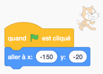

.. qnum::
   :prefix: scratch-intro
   :start: 1

Introduction à Scratch (envoyer à tous)
============================================

.. topic:: Aperçu rapide de la journée

    Introduction au cours, et à l'environnement Scratch. Explique le plan de coordonnées utilisé dans Scratch et les blocs de mouvement de base. Présentez l'idée d'utiliser le bloc de **envoyer à tous** (*diffusion*) dans l'onglet **Événement** pour envoyer des messages, qui est utilisé pour contrôler le déroulement du programme.

.. reveal:: curriculum_addressed_introduction_scratch
    :showtitle: Résultats du programme d'études traités dans cette section. 
    :hidetitle: Cacher les résultats du programme

    - **20IN-PT.1** Appliquer diverses stratégies de résolution de problèmes pour résoudre des problèmes de programmation dans le cours Informatique 20.
    - **20IN-FP.2** Faire des recherches sur la manière dont les structures de contrôle affectent le déroulement du programme.

Introduction
----------------------------

Bienvenue! Le but de ce cours est de vous apprendre à résoudre des problèmes, et nous utiliserons les concepts de l'informatique pour atteindre cet objectif. À la fin de la session, vous serez en mesure de résoudre les problèmes en toute confiance en écrivant des programmes informatiques. En d'autres termes, vous serez en mesure de contrôler ce que l'ordinateur fait en écrivant des algorithmes (une série d'étapes).

Bien que nous finirons par écrire du texte brut dans un fichier pour créer des programmes informatiques, ce processus peut être un peu intimidant. Pour vous aider à comprendre ce que vous êtes capable d'enseigner à un ordinateur, nous suivrons le processus suivant:

- utiliser un environnement de programmation visuel (cela vous permettra de comprendre les structures de contrôle de base de l'informatique et vous évitera de faire des erreurs de syntaxe qui amèneraient votre programme à signaler une erreur lorsque vous l'exécutez)
- utilisez un langage contraint pour résoudre les puzzles algorithmiques (ici vous tapez du texte pour contrôler ce que fait l'ordinateur, ce qui signifie que vous rencontrerez des erreurs de syntaxe, mais les énigmes que vous résolvez vous donneront un retour visuel instantané)
- utiliser un langage informatique "traditionnel" (une fois que vous vous sentirez confiant avec de nombreuses idées de base de l'informatique, nous les appliquerons en utilisant un langage informatique traditionnel)

Votre premier programme informatique!
--------------------------------------

Il existe de nombreux environnements de programmation visuelle différents, mais celui que nous utiliserons s'appelle `Scratch <https://scratch.mit.edu/>`_. Votre première tâche consiste à créer un compte sur le site Web Scratch, afin que les programmes que vous écrivez puissent être sauvegardés et consultés plus tard. 
`Allez faire cela maintenant! <https://scratch.mit.edu/>`_  

Si vous préférez regarder une vidéo, la `vidéo <https://www.youtube.com/watch?v=pJYCRtSDJSk>`_ suivante montre les mêmes idées que celles que j'ai décrites dans le texte ci-dessous.

.. youtube:: pJYCRtSDJSk
    :height: 315
    :width: 560
    :align: left
    :http: https

Maintenant que vous avez un compte, faisons votre premier programme informatique du semestre! Cliquez sur le bouton Créer en haut du site Web Scratch pour **créer** un nouveau projet.

Dans la vue du projet, l'écran est divisé en plusieurs volets, y compris la scène (où vous verrez votre projet s'exécuter), la liste des sprites (montre quels sprites font partie de votre projet, et vous permet de les sélectionner), palette de blocs (voici tous les blocs que vous pouvez glisser et déposer sur vos scripts), et la zone des scripts (où vous allez combiner des blocs de code pour créer des programmes pour vos sprites à exécuter). L'une des choses les plus importantes à garder à l'esprit est que **vous ne pouvez pas briser l'environnement**, alors n'hésitez pas à explorer autant que vous voulez!

.. image:: images/scratch_areas.png

.. sidebar:: Note de l'enseignant

    Vous voudrez peut-être passer un peu de temps à explorer l'environnement avec les élèves avant de créer le premier programme.

Pour notre premier programme, **créons une conversation simple entre deux sprites**. Pour ce faire, vous devez **ajouter** un deuxième sprite au projet. Il existe plusieurs façon d'en ajouter, chacune représenté par une icône en haut du volet de la liste des sprites. Vous pouvez survoler chacune des images avec votre souris pour découvrir ce qu'elles représentent. Pour l'instant, utilisez l'icône **"Choisir un sprite dans la bibliothèque"** pour ajouter un sprite supplémentaire à la scène.

.. image:: images/scratch_add_new_sprite_from_library.png

Pour cet exemple, j'ai inclus le sprite Giga (dans le thème espace), donc ma scène ressemble à ceci:

.. image:: images/scratch_initial_characters.png

.. note:: Une fois que vous avez plus qu'un sprite dans la liste des sprites, vous pouvez voir que le volet de la zone des scripts affiche le script du sprite sélectionnée. Pour être sûr de comprendre cela, faites glisser un bloc de la palette de blocs dans la zone des scripts. Maintenant, sélectionnez un autre sprite dans la liste des sprites en cliquant dessus. Notez comment les blocs de la zone de scripts changent lorsque vous sélectionnez une autre sprite.

Maintenant que vous avez deux sprites dans la liste des sprites, faisons en sorte qu'ils aient une conversation simple. Sélectionnez l'onglet **Apparences** *looks* dans la palette de blocs, puis faites glisser **"dire "Bonjour" pendant 2 secondes"** dans la zone des scripts. Un moyen rapide de voir le résultat de ce bloc est en double-cliquant dessus. Essayez-le maintenant! *Notez que la petite image du chat dans les images suivante est pour montrer quel sprite est sélectionné dans la liste des sprites lorsque vous faites glisser le bloc de la palette de blocs vers la zone des scripts*.

Bien sûr, nous ne voulons pas devoir double-cliquer sur le bloc pour que la conversation ait lieu, nous devons donc avoir un événement qui déclenche le bloc. Sélectionnez l'onglet **Evénements** *events* dans la palette des blocs, puis faites glisser le bloc **"quand drapeau est cliqué"** dans la zone des scripts. Maintenant, faites glisser  "dire "Bonjour" pendant 2 secondes" jusqu'à ce qu'il s'enclenche sur le bloc **"quand drapeau est cliqué"**. À ce stade, vous devriez être en mesure de faire votre sprite dire Bonjour lorsque vous cliquez sur le drapeau au-dessus de la scène.

.. image:: images/scratch_blocks_connected.png

Avant de poursuivre la conversation, nous devrions savoir comment supprimer les blocs. Si vous avez un bloc dans votre zone de scripts que vous ne voulez plus, il suffit de le faire glisser dans la palette de blocs et de relâcher la souris.

.. image:: images/scratch_deleting_a_block.gif

Pour faire avancer notre conversation, faites glisser un sprite sur le côté gauche de la scène, et l'autre sur le côté droit de la scène. Maintenant, fixons leurs emplacements de départ. Accrocher le personnage sur le côté gauche de la scène à un bloc, comme suit:

Le personnage sur le côté droit de la scène devrait avoir un script similaire à ceci:

.. image:: images/scratch_goTo_2.png

.. note::
  Notez que Scratch utilise le plan cartésien (le système de grille x-y que vous avez appris en mathématique), et que l'origine est directement au centre de la scène, comme indiqué ci-dessous:

  .. image:: images/scratch_coordinate_plane.png
     :align: center

Faites glisser les deux sprites vers les emplacements que vous souhaitez qu'ils soient quand ils vont avoir la conversation avec le bloc **"aller à x: y:"**. Notez que les valeurs x et y dans le bloc Atteindre dans la palette de blocs sont mises à jour avec les emplacements x et y du sprite lorsque vous relâchez la souris. Maintenant, accrochez **"glisser en 1 secondes à x: y:"** au bas du script du personnage venant du côté gauche de la scène. Ensuite, faites glisser   "dire "Bonjour" pendant 2 secondes" pour que le personnage commence la conversation. Enfin, faites glisser un bloc envoyer à tous (*broadcast*) de l'onglet **"Evénements"** et accrochez-le au bas du script. Il devrait maintenant ressembler à ceci:

.. image:: images/scratch_goTo_andGlide.png

Envoyer à tous *Broadcasts*
----------------------------

Quel est le but de ce bloc envoyer à tous que nous avons ajouté au script? Dans cette situation, nous voulions que le deuxième sprite (celui qui vient du côté droit de l'écran) fasse quelque chose **une fois qu'une action effectuée par un autre sprite sera terminée.** Les blocs de *diffusion* nous permettent d'envoyer des messages, et tout sprite (y compris le sprite qui a envoyé le message) dans notre projet peut écouter ce message et répondre en conséquence. Cette fois, nous aimerions que le deuxième sprite entre dans l'écran après que le premier sprite se soit déplacé au milieu de l'écran et ait dit quelque chose.

.. note:: Les blocs envoyer à tous sont un moyen simple d'introduire l'idée du paradigme de la programmation événementielle. Bien qu'une grande partie de ce cours utilisera le paradigme de la programmation procédurale, il est vraiment utile de comprendre le concept de base de la réponse aux événements de l'utilisateur!

Pour qu'un autre sprite écoute à la diffusion du bloc envoyer à tous, cliquez sur le sprite à laquelle vous souhaitez réagir, puis faites glisser un bloc **"quand je reçois"** de l'onglet **"Evénements"** de la palette de blocs vers la zone des scripts. Nous pourrions faire en sorte que le personnage fasse ce que nous voulons, mais pour cet exemple, faisons en sorte que nos personnages aient une conversation simple. Recréez les éléments suivants et cliquez sur le drapeau vert. 

.. image:: images/scratch_when_i_receive.png

Nous pouvons brancher autant de blocs envoyer à tous enchaînées que nous le voulons. Par exemple, dans l'exemple ci-dessous, les deux caractères réagissent au drapeau sur lequel ils cliquent en se rendant à leurs emplacements de départ. Après cela, la chaîne d'événements est contrôlée par blocs envoyer à tous suivantes:

- Giga entre
- Cat réplique
- Au revoir!

.. image:: images/scratch_conversation_complete.png

Notez également que n'importe quel nombre de sprites peut réagir à la même bloc envoyer à tous. Dans l'exemple ci-dessus, un seul sprite réagit aux blocs envoyer à tous "Giga entre" et "Réponse de chat". Pour la diffusion "Au revoir", cependant, Cat et Giga réagissent en se cachant.

Vérifie ta compréhension
~~~~~~~~~~~~~~~~~~~~~~~~~

.. mchoice:: scratch_broadcast_check_1
   :answer_a: Le sprite actuel dirait "Aller"
   :answer_b: Le sprite actuel dirait "Aller", ensuite dirait "Vert!"
   :answer_c: Le sprite actuel dirait "Vert!", Ensuite "Aller" 
   :answer_d: Le sprite actuel dirait "Vert!" 
   :correct: b
   :feedback_a: Bien que cela se produise, ce n'est pas la seule chose qui se produise! Considérez ce qui se passe lorsque la envoyer à tous est envoyée.
   :feedback_b: Oui! Le sprite dirait "Aller" pendant 1 seconde, puis diffusera <em>premier</em>, auquel il répondra en disant "Vert!" pendant 1 seconde.
   :feedback_c: Non, il dira d'abord "Aller" (puisque c'est la première partie du code qui s'exécute lorsque l'utilisateur clique sur le drapeau).
   :feedback_d: Bien que cela se produise, il dira d'abord "aller" (puisqu'il s'agit de la première chose dans le code qui s'exécute lorsque l'utilisateur clique sur le drapeau).

   Que se passerait-il lorsque vous cliqueriez sur le drapeau vert, étant donné le code ci-dessous?

   .. image:: images/scratch_broadcast_check_1.png

.. mchoice:: scratch_broadcast_check_2
   :answer_a: Le sprite actuel dit "Allez" pendant 1 seconde, ensuite "Vert!" pendant 1 seconde, puis se déplace de 10 pas. 
   :answer_b: Le sprite actuel dirait "Allez" pendant 1 seconde, se déplace de 10 pas, puis dirait "Vert!" pendant 1 seconde après l'arrêt du sprite.
   :answer_c: Le sprite actuel dirait "Allez" pendant 1 seconde, puis déplacez simultanément 10 étapes et dirait "Vert!" pendant 1 seconde.
   :correct: c
   :feedback_a: Non, l'envoi de la diffusion (*bloc envoyer à tous*) entraînera l'exécution du deuxième groupe de blocs, mais n'empêchera pas le premier groupe de code de continuer à s'exécuter. C.À.D., Scratch n'attendra pas que la diffusion soit résolue avant de terminer le reste du groupe de code (dans ce cas, le bloc de déplacement de 10 pas).
   :feedback_b: Non, le bloc dit "vert et le bloc de déplacement de 10 pas auront lieu simultanément.
   :feedback_c: Oui, l'envoi de la diffusion entraînera l'exécution du deuxième groupe de blocs, mais n'empêchera pas le premier groupe de code de continuer à s'exécuter.

   Que se passerait-il lorsque vous cliqueriez sur le drapeau vert, étant donné le code ci-dessous?

   .. image:: images/scratch_broadcast_check_2.png

.. mchoice:: scratch_broadcast_check_3
   :answer_a: Le sprite actuel dirait "Allez" pendant 1 seconde, ensuite "Vert!" pendant 1 seconde, puis se déplace de 10 pas. 
   :answer_b: Le sprite actuel dirait "Aller" pendant 1 seconde, se déplace de 10 pas, ensuite dit "Vert!" pendant 1 seconde après l'arrêt du sprite. 
   :answer_c: Le sprite actuel dirait "Aller" pendant 1 seconde, se déplace simultanément de 10 pas et dit "Vert!" pendant 1 seconde.
   :correct: a
   :feedback_a: Oui! Puisque nous utilisons maintenant un bloc envoyer à tous **et attendre**, Scratch mettra en pause l'exécution du groupe de code qui a envoyé la diffusion jusqu'à ce que tous les scripts ayant réagi à la diffusion soient terminés.
   :feedback_b: Non, la diffusion a lieu avant le déplacement, ainsi le sprite dira "Vert" avant de se déplacer.
   :feedback_c: Non, puisque nous utilisons un bloc de envoyer à tous **et attendre**, les deux scripts ne seront pas exécutés simultanément cette fois-ci.

   Que se passerait-il lorsque vous cliqueriez sur le drapeau vert, compte tenu du code ci-dessous?

   .. image:: images/scratch_broadcast_check_3.png

Problème de pratique
---------------------

Faites un nouveau projet Scratch. Enregistrez-le en tant que Conversation et ajouté le lien dans votre dossier de travail sous "Scratch-1-converstion". Choisissez au moins deux sprites, et faites-leur une petite conversation. Assurez-vous d'utiliser des **envoyer à touss** pour contrôler le déroulement de votre programme! 
 
Si vous voulez un peu plus d'un défi, explorez la palette de blocs et incorporez d'autres blocs qui n'ont pas encore été discutés!
