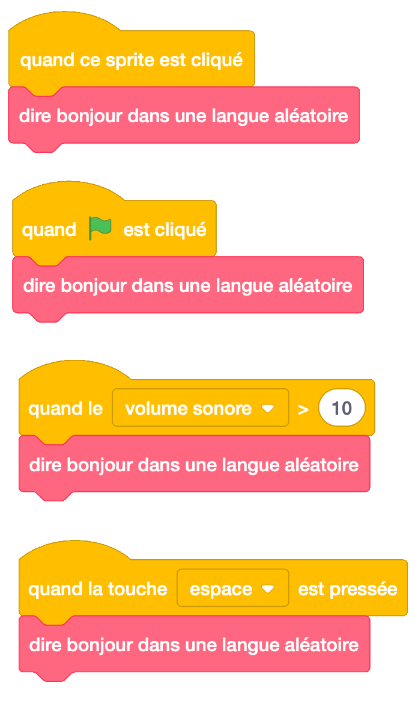
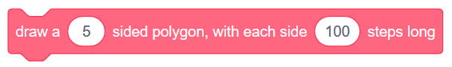
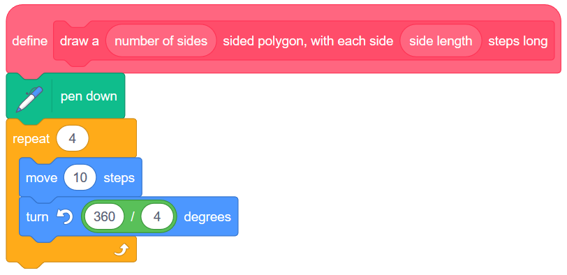
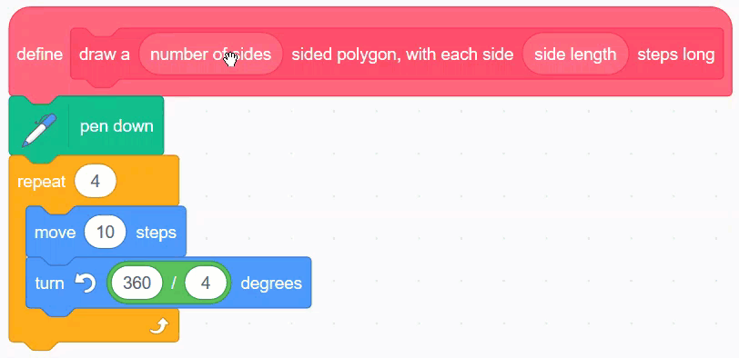

.. qnum::
   :prefix: scratch-functions
   :start: 1

Créer Vos Propres Blocs (*fonctions*)
=======================================

.. topic:: Aperçu rapide de la journée

    Définir vos propres blocs dans Scratch. Créez un bloc qui dit un message d'accueil aléatoire (aucun argument requis), puis créez un bloc qui dessine un polygone avec un certain nombre de côtés (argument requis).

.. reveal:: curriculum_addressed_make_own_blocks
    :showtitle: Résultats du programme d'études traités dans cette section. 
    :hidetitle: Cacher les résultat du programme

    - **CS20-CP1** Apply various problem-solving strategies to solve programming problems throughout Computer Science 20.
    - **CS20-FP1** Utilize different data types, including integer, floating point, Boolean and string, to solve programming problems.
    - **CS20-FP2** Investigate how control structures affect program flow.
    - **CS20-FP3** Construct and utilize functions to create reusable pieces of code.

Si vous préférez regarder une vidéo, la `vidéo <https://www.youtube.com/watch?v=mXH0WTfA5eo>`_ suivante illustre les mêmes idées que celles décrites dans le texte ci-dessous.

.. youtube:: mXH0WTfA5eo
    :height: 315
    :width: 560
    :align: left
    :http: https

.. index:: functions

Le boc "dire message d'accueil
-------------------------------

À ce stade de notre exploration de Scratch, nous avons appris à utiliser un grand nombre de blocs différents. Que faisons-nous, cependant, lorsque nous souhaitons disposer de fonctionnalités non intégrées à Scratch? En fin de compte, nous pouvons créer nos propres blocs et les utiliser comme les blocs intégrés! C'est une idée incroyablement puissante en informatique, et dans la plupart des langues, on appelle créer vos propres fonctions (nous verrons bientôt comment le faire dans une autre langue!).

Nous voudrions peut-être avoir un bloc qui dirait une salutation, en choisissant une au hasard parmi plusieurs langues différentes. Pour cet exemple, notre bloc choisira parmi l’un des voeux suivants:

+--------+----------+-------------------+
| Nombre | Langue   |     Salutaion     |
+========+==========+===================+
|      1 | Anglais  | Hello             |
+--------+----------+-------------------+
|      2 | Français | Bonjour           |
+--------+----------+-------------------+
|      3 | Cree     | Tanisi            |
+--------+----------+-------------------+
|      4 | Chinois  | nǐ hǎo            |
+--------+----------+-------------------+
|      5 | Arabe    | as-salām 'alaykum |
+--------+----------+-------------------+
|      6 | Allemand | Guten Tag         |
+--------+----------+-------------------+
|      7 | Punjabi  | sat srī akāl      |
+--------+----------+-------------------+
|      8 | Espagnol | ¡Hola!            |
+--------+----------+-------------------+

Il y a 8 salutations différentes énumérées ci-dessus. Afin de choisir entre eux, nous devons faire en sorte que Scratch choisisse un nombre aléatoire compris entre 1 et 8, puis prononce l'un des voeux ci-dessus en fonction du nombre choisi. Si nous voulions que notre sprite dise une salutation aléatoire lorsque nous appuyons sur le drapeau, nous pourrions créer les éléments suivants:

Si nous voulions que notre sprite dise une salutation aléatoire dans plusieurs situations? Peut-être souhaitons-nous toujours que le sprite prononce un message d'accueil lorsque l'utilisateur clique sur le drapeau, mais nous souhaitons également qu'il le dise lorsque l'utilisateur clique dessus le sprite, lorsque la touche d'espacement est enfoncée ou lorsque le niveau de bruit de la salle avec notre ordinateur devient particulièrement bruyant. Jusqu'à présent, nous devions dupliquer le code que nous venons de créer et le joindre à plusieurs événements. Un meilleur moyen consiste à créer un nouveau bloc, appelé «dit bonjour dans un langage aléatoire». Pour ce faire, sélectionnez l'onglet *Mes blocs*, puis cliquez sur **Créer un bloc**. Dans le bloc vide qui apparaît maintenant, tapez le nom que vous souhaitez donner à votre nouveau bloc:

.. image:: images/scratch_define_new_block_fr.gif

Vous verrez maintenant apparaître un nouveau bloc de style d’événement dans votre zone de script, appelé «définir dit bonjour dans un langage aléatoire». Vous devez faire glisser le code précédemment associé au bloc «Quand le drapeau est cliqué» et le joindre à ce nouveau bloc de définition.

Une fois ce nouveau bloc défini, nous pouvons l'appeler comme n'importe quel autre bloc intégré. Pour ce faire, faites simplement glisser le bloc à partir de l'onglet *Mes blocs*. Nous pouvons maintenant demander à notre sprite de dire bonjour dans une langue aléatoire lorsque de nombreux événements différents se produisent, sans avoir à dupliquer notre code à plusieurs reprises.

Dessiner un bloc polygonal
----------------------------

Si vous inspectez les blocs intégrés disponibles dans Scratch, vous remarquerez qu'il existe deux types de blocs différents.

Pour certains blocs, tels que le bloc "rebondir si le bord est atteint" dans l'onglet *Mouvement*, nous ne fournissons aucune information supplémentaire au bloc. Avec le bloc “avancer de 10 pas”, cependant, nous pouvons contrôler le comportement du bloc en modifiant la valeur de l'**argument** du bloc (défini à l'origine sur 10). Le bloc d'accueil que nous avons présenté ci-dessus ne contenait aucun argument. Essayons de créer un bloc qui prend des arguments.

Lorsque nous avons commencé à explorer :ref:`scratch_variables`, nous avons trouvé un bon modèle pour nous aider à dessiner des polygones réguliers. Nous voulons utiliser ce modèle à nouveau, cette fois pour créer un bloc semblable au suivant:

Pour créer un bloc qui prend des arguments, sélectionnez d'abord «Créer un bloc» dans l'onglet **Mes blocs**. Tapez Draw a, puis cliquez sur Options et sélectionnez «Ajouter un numéro». Étiquetez le nombre de côtés du nombre saisi, puis ajoutez un polygone à texte libellé à chaque côté. Ajoutez une autre entrée numérique appelée side long, puis identifiez les étapes de texte.

In order to create a block that takes arguments, first select "Make a Block" from the More Blocks tab. Type in ``draw a``, then click Options, and select "Add number input". Label the number input ``number of sides``, then add label text ``sided polygon, with each side``. Add another number input called ``side length``, then finally label text ``steps long``.

Now that you have a block definition in your scripts area, recall the pattern that we used to draw regular polygon. If we only wanted to draw a square, our code would look like this:

We obviously do not want to have the block always draw a square. To allow the arguments that we pass to the block to be used, we simply drag them from the block definition into the code. For this code, drag the ``number of sides`` number input onto both the repeat block, as well as the turn block. Then drag the ``side length`` number input onto the move block.

Now that we have set up our drawing polygon block, you can use it like any other scratch block. For example, if you wanted to have a pentagon drawn when the user presses the space key, you would simply choose a 5 sided polygon, and pick a side length for the drawing.

Practice Problem
-----------------

Work on your current Scratch assignment, for any remaining time.

.. note:: If your teacher did not assign you a project, you should explore the Scratch website to discover what types of projects are possible. Now try to create the most impressive project you can, making sure you demonstrate your understanding of the main topics shown so far (broadcasts, repetition, if/else, and variables).
