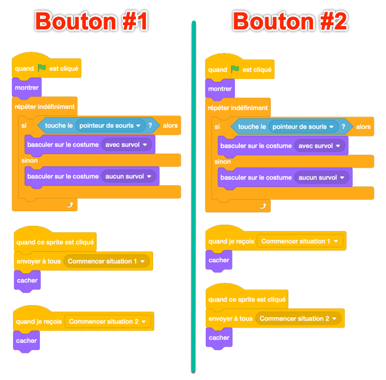
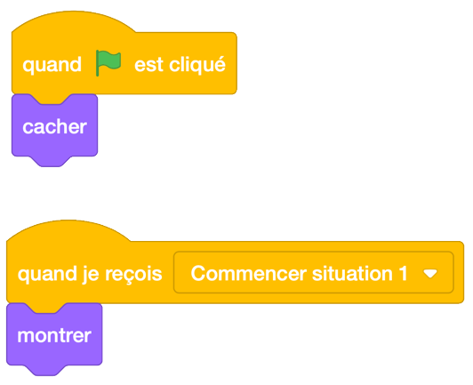

.. qnum::
   :prefix: scratch-start-screen
   :start: 1

Créer un écran de démarrage (Répéter, Si/Sinon, Diffuser "*envoyer à tous*")
============================================================================

.. topic:: Aperçu rapide de la journée

    Utilisez une combinaison des blocs **répéter indéfiniment**, **diffusion/evoyer à tous**, et **si/sinon** pour créer un simple écran de démarrage. Créez plusieurs costumes pour les sprites du bouton afin de fournir un retour visuel lorsque l'utilisateur survole le bouton.

.. reveal:: curriculum_addressed_start_screen
    :showtitle: Résultats du programme d'études traités dans cette section. 
    :hidetitle: Cacher les résultat du programme

    - **CS20-CP1** Apply various problem-solving strategies to solve programming problems throughout Computer Science 20.
    - **CS20-FP2** Investigate how control structures affect program flow.

Si vous préférez regarder une vidéo, la `vidéo suivante <https://www.youtube.com/watch?v=mrLWnxC07DU>`_ illustre les mêmes idées que celles décrites dans le texte ci-dessous.

.. youtube:: mrLWnxC07DU
    :height: 315
    :width: 560
    :align: left
    :http: https

Vue de l'ensemble
------------------

Dans certains programmes, nous souhaitons proposer à l'utilisateur un choix quant à ce qu'il souhaite faire. Par exemple, beaucoup de jeux ont un écran de démarrage avec des boutons pour démarrer le jeu, configurer les options, voir les meilleurs scores, etc. Nous pouvons accomplir cela dans Scratch en utilisant une combinaison des blocs répéter **indéfiniment**, **diffusion/envoyer à tous**, et **si/sinon**. Bien qu’il n’y ait pas de nouveaux concepts présentés dans cette section, cela explique comment vous pouvez créer quelque chose d’utile avec les blocs que nous avons vus jusqu’à présent.

Créer un bouton Sprite
-------------------------

La première étape dans la création d’un écran de démarrage consiste à créer des boutons. Pour ce faire, nous allons peindre à nouveau un nouveau sprite. Commencez par cliquer sur le bouton **peindre** un nouveau sprite:

.. image:: images/scratch_paint_new_sprite.gif

Suivez les étapes ci-dessous pour créer votre sprite de bouton (si ces instructions ne vous suffisent pas pour comprendre le processus, vous devriez regarder la vidéo ci-dessus):

- convertir en mode vecteur
- sélectionnez l'outil rectangle et dessinez un rectangle à l'écran
- Remplissez un rectangle avec une couleur (outil de remplissage) - même si vous décidez de créer un arrière-plan blanc, vous devez suivre cette étape ou cliquer sur l'intérieur du rectangle ne le sélectionnera pas car il y aura un arrière-plan transparent.
- choisissez une couleur contrastante qui sera utilisée pour votre police
- sélectionnez l'outil de texte et ajoutez l'étiquette du bouton (quelque chose comme «commencer la situation 1»)
- nommer le costume quelque chose de descriptif (comme "Ne survol pas")
- faites un clic droit sur le costume et sélectionnez Dupliquer
- renommer ce deuxième costume comme "survol"
- sélectionnez différentes couleurs pour ce second costume et appliquez les nouvelles couleurs à l'arrière-plan et à la police à l'aide de l'outil remplissage

Configurer le bouton pour réagir à la souris
----------------------------------------------

Maintenant que vous avez peint un sprite, nous voulons le faire se comporter comme un bouton. Il y a deux parties à cela: nous voulons que le sprite réagisse au survol de la souris par-dessus le bouton et nous souhaitons diffuser un message lorsque le bouton est enfoncé. Vous pouvez accomplir cela en créant un code similaire à celui-ci:

Assurez-vous de créer des noms de message descriptifs. Les émissions sont **beaucoup** plus faciles à suivre si elles sont nommées *correctement*.

.. note:: Vous pouvez gagner du temps en complétant totalement le premier bouton, en cliquant avec le bouton droit de la souris sur le sprite du bouton dans la liste des sprites et en sélectionnant dupliquer. Cela copiera tous les costumes et le code associés au sprite, ce qui signifie qu'il ne reste que quelques modifications à apporter.

Ajouter des personnages à la situation
---------------------------------------

Vous pouvez utiliser un écran de démarrage comme vous le souhaitez, mais pour compléter cet exemple simple, différents sprites apparaîtront à l’écran lorsque vous appuierez sur un bouton ou l’autre.

Choisissez un ou deux sprites dans la bibliothèque, positionnez-les quelque part à l'écran et ajoutez-leur le code suivant:

Choisissez un ou deux autres sprites de la bibliothèque, positionnez-les quelque part à l'écran et appliquez-leur le code suivant:

Vous devriez maintenant pouvoir cliquer sur le drapeau vert pour réinitialiser votre écran de démarrage. En cliquant sur chaque bouton, différentes sprites doivent apparaître à l'écran. Bien sûr, dans vos propres projets, vous pouvez faire faire n’importe quoi quand vous appuyez sur le bouton!

Problème de pratique
---------------------

Travaillez sur votre deuxième affectation Scratch, pour le temps restant.

.. note:: Si votre professeur ne vous a pas assigné de projet, vous pouvez envisager de créer un simulateur Roche Paper Scissors afin de vous exercer à maîtriser Scratch. Vous devrez utiliser des variables, des blocs **si-sinon** et des **diffusions**. Une extension intéressante de la version de base de ce projet est de permettre à l’utilisateur de choisir de jouer contre un autre joueur ou contre l’ordinateur. *Vous pouvez utiliser un écran de démarrage* pour permettre à l'utilisateur de choisir le type de jeu qu’il veut jouer.