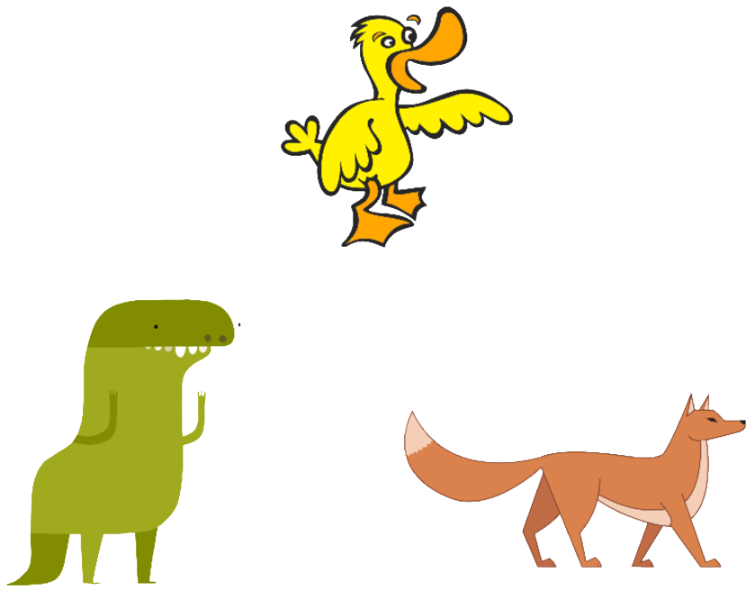
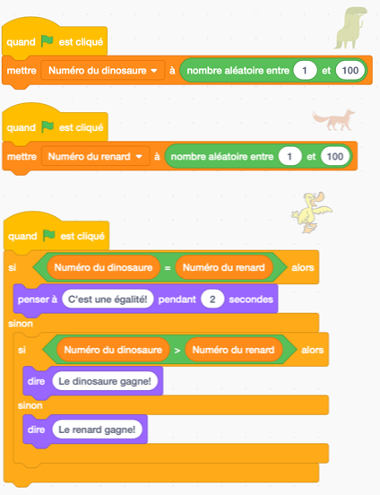
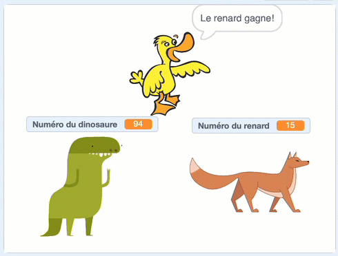
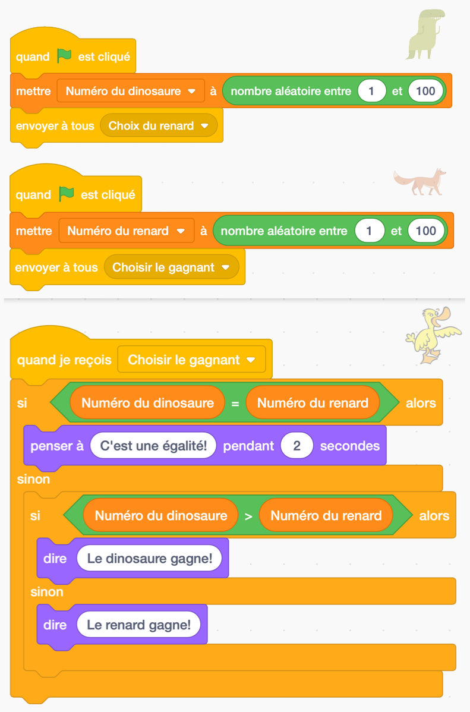
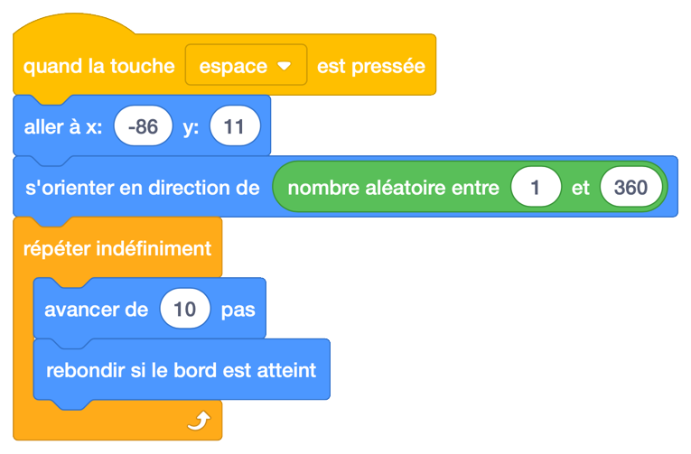
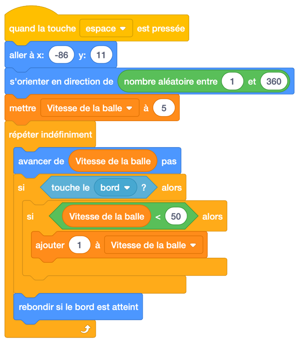
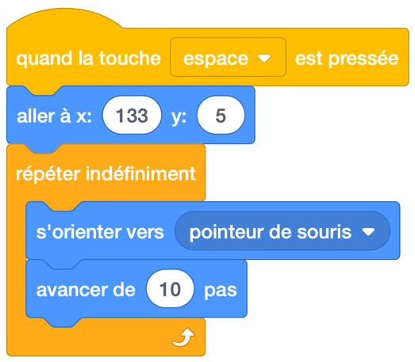
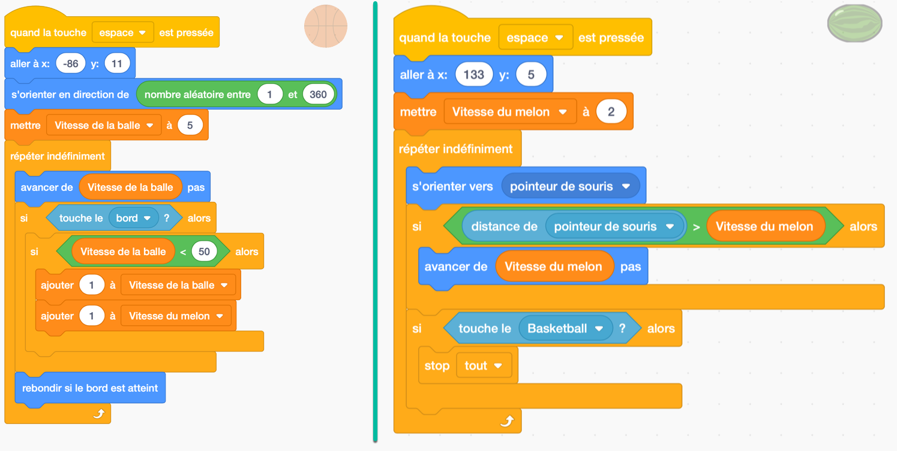

.. qnum::
   :prefix: scratch-broadcasts
   :start: 1

Problèmes de chronométrage et jeu d’esquive (envoyer à tous et variables)
==========================================================================

.. topic:: Aperçu rapide de la journée

    Explorez les problèmes qui surviennent lorsque plusieurs scripts sont déclenchés par le même événement et les résoudre en configurant des diffusions *ordonnées*. Créez un jeu d'esquive d'objet, en utilisant des variables permettant à l'objet et au personnage d'augmenter en vitesse à mesure que le jeu avance.

.. reveal:: curriculum_addressed
    :showtitle: Curriculum Outcomes Addressed In This Section

    - **CS20-CP1** Apply various problem-solving strategies to solve programming problems throughout Computer Science 20.
    - **CS20-CP2** Use common coding techniques to enhance code elegance and troubleshoot errors throughout Computer Science 20.
    - **CS20-FP2** Investigate how control structures affect program flow.

Si vous préférez regarder une vidéo, la `vidéo suivante <https://www.youtube.com/watch?v=1vPKlqxNloc>`_ illustre les mêmes idées que celles décrites dans le texte ci-dessous.

.. youtube:: 1vPKlqxNloc
    :height: 315
    :width: 560
    :align: left
    :http: https

Problème de Timing
-------------------

Lorsque vous commencez à créer des projets plus complexes dans Scratch, il est possible de rencontrer des problèmes que nous appellerons *problèmes de timinmg*. Cela peut arriver lorsque vous répondez à un événement avec plusieurs sprites. Bien que vous puissiez certainement réagir à un événement avec de nombreux sprites, il n’y a aucune garantie quant à l’ordre dans lequel ces réponses vont se produire. Si la réponse d'un sprite dépend du fait qu'un autre sprite effectue déjà une action, cela peut poser des problèmes qui sont difficiles à trouver dans votre projet.

Pour illustrer ce problème, nous allons créer un "jeu" très simple qui expose intentionnellement ce problème. Tout d’abord, créez trois sprites et positionnez-les sur la scène comme ceci:

Pour notre jeu, les sprites de dinosaures et de rennes choisiront chacun un nombre aléatoire  entre 1 et 100. Le sprite de canard déterminera alors quelle sprite sera gagnante (en vérifiant quel est le plus grand nombre) et annoncera le gagnant. Ce serait évidemment un jeu terrible à jouer avec des humains, mais cela servira joliment à illustrer des problèmes de timing possibles.

Nous devons créer deux variables, une pour contenir le nombre choisi par le dinosaure et l'autre pour contenir le nombre choisi par le renne. Accédez à l'onglet *Variables* pour les créer, en vous assurant de fournir des noms descriptifs pour les variables.

.. note:: 
	Lors de la création de vos variables, vous devez laisser le bouton **Pour tous les sprites** sélectionné (au lieu de le basculer sur **Pour ce sprite uniquement**) sauf si vous avez une très bonne raison de déclarer la variable uniquement accessible par ce sprite. Si vous créez une variable pour ce sprite uniquement, aucune autre sprite ne peut voir quelle est la valeur de cette variable (même si vous faites glisser la variable sur une autre sprite). Vous pouvez dire que vous avez créé une variable pour une seule sprite si, avant le nom de la variable, Scratch affiche le nom de l'sprite suivi de deux points:

	.. image:: images/scratch_variable_scope.png
	
Configurez la version de base du jeu en créant les scripts suivants pour vos sprites:

Pour que les variables soient un peu plus agréables à regarder, vous pouvez cliquer avec le bouton droit de la souris sur la variable (comme indiqué sur la scène) et sélectionner l'option "Grande lecture". Maintenant, faites glisser cette variable afin qu'elle soit par dessus le sprite approprié.

Vous devriez maintenant tester votre programme en appuyant plusieurs fois sur le drapeau vert. Vous remarquerez que votre programme sélectionnera parfois le bon gagnant, mais fera souvent une erreur pour déterminer qui a gagné. Pourquoi cela arrive-t-il? La logique du sprite de canard est correcte, et pourtant nous rencontrons une erreur ...

Bien que la logique individuelle de chacun de nos sprites soit correcte, **ils réagissent tous au même événement** (dans ce cas, quand l'utilisateur clique sur le drapeau). Nous ne pouvons donc pas garantir l'ordre dans laquelle ces trois commmende seront exécutée. Lorsque le drapeau est cliqué, nous ne savons pas si le code du dinosaure, du renne ou du canard sera exécuté en premier. Si le code de canard arrive avant que les deux autres sprites ne sélectionnent leur nouveau numéro, le canard peut prendre une décision en fonction des numéros sélectionnés lors du dernier clic sur le drapeau (ou d'un ancien et d'un nouveau numéro).

Comme nous devons garantir l'ordre d'exécution de ces scripts, nous pouvons le refaire de sorte que le dinosaure choisisse un numéro lorsque le drapeau est cliqué, puis diffuse un message invitant le renne à choisir un numéro. Le renne peut réagir à ce message en choisissant un numéro, puis diffuser un message invitant le canard à déterminer le vainqueur. Avec cette configuration, nous sommes assurés d'avoir les deux numéros choisis avant que le canard ne tente de décider quel sprite est le gagnant.

Jeu d'esquive
--------------

Essayons quelque chose de totalement différent. Cet exemple ne nécessitera pas que nous réfléchissions aux problèmes de synchronisation qui peuvent surgir lorsque nous répondons au même événement avec plusieurs sprites, mais cela nous permettra d'utiliser un bon nombre des idées que nous avons apprises jusqu'à présent. Nous allons créer un jeu d’esquive dans lequel une balle rebondit autour de l’écran et un deuxième objet qui suit notre souris autour de l’écran. Dès que la balle qui rebondit entre en contact avec l'objet suivant notre souris, le jeu se termine.

Pour commencer, sélectionnez une balle et ajoute-la à votre projet. Je vais avec un ballon de basket. Faites glisser la balle vers la gauche de l’écran afin d’éviter les collisions dès le début de la partie. Nous devons ensuite choisir une direction aléatoire que le ballont devrait se déplacer, puis toujours continuer dans cette direction, et rebondir si il touche le bord de la scène. Ajoutez le script suivant à votre ballon:

Bien que la version ci-dessus fonctionne, le jeu aura toujours le même niveau de difficulté, car le ballon se déplace à une vitesse constante. Pour rendre le jeu plus intéressant, nous aimerions que le ballon commence par un mouvement relativement lent et qu’il accélère tout au long du match. Chaque fois que nous avons besoin d’une valeur à modifier au cours de notre projet, nous devrions envisager l’ajout d'une variable. Créez une variable appelée **Vitesse de la balle** (dans l'onglet Variables), puis modifiez le script de la balle comme ceci:

Notez que dans le script ci-dessus, nous avons créé une valeur maximale de 50 que la vitesse de la balle peut augmenter jusqu'à. Si nous n'avions pas le bloc "si la vitesse de la balle est <50", la balle continuerait à augmenter sa vitesse tout au long du jeu et finirait par se déplacer si vite que des problèmes graphiques se produiraient (puisque la balle se déplacerait de plus "de pixels/de pas" que l’écran contient).

Nous devons maintenant créer un sprite qui suivra notre souris autour de l'écran tout en essayant d'esquiver la balle qui rebondit. Je vais avec un melon d'eau, mais vous pouvez choisir n'importe quel sprite. Faites glisser le melon quelque part sur le côté droit de la scène pour éviter une collision dès le début de la partie. Nous voulons maintenant que le melon se déplace toujours dans le sens de la souris. Essayez d’ajouter un script semblable à celui-ci à votre sprite et testez-le:

Lorsque vous exécutez le script indiqué ci-dessus, vous pouvez voir que, bien que le melon suive la souris, il existe quelques problèmes. Un problème est que le melon se déplace à la même vitesse pour tout le jeu. Pour résoudre ce problème, nous devons créer une autre variable (quelque chose comme "**Vitesse du melon**") qui augmente au même rythme que le ballon qui rebondit.

Un autre problème est que lorsque le melon "attrape" la souris, elle a un mouvement incroyablement nerveux (presqu'une vibration du sprite). Cela se produit parce que le melon pointe vers la souris, la dépasse, se retourne puis recommence. Un bon moyen de résoudre ce problème est d’abord de demander si la distance par rapport à la souris est supérieure à la vitesse de déplacement de le melon; et de seulement se déplacer vers la souris si le melon ne la dépassera pas.

Le dernier problème est que nous n’avons pas vérifié si le melon d’eau touchait le ballon de basket. Nous devons ajouter cette question au script et arrêter tout ce qui se passe lorsque les deux sprites se touchent.

Pour résoudre chacun de ces problèmes, adaptez votre code précédent comme ceci:

.. note:: Une extension intéressante du jeu d'esquive consiste à jouer un jeu sonore lorsque les sprites se rencontrent. Vous devrez peut-être utiliser une diffusion et explorer le bloc **Stop "autres scripts dans sprite"** (dans l'onglet **Contrôle**) pour le faire fonctionner.

Problème de pratique
----------------------

Travaillez sur votre deuxième affectation Scratch, pour le temps restant.
 
.. note:: Si votre enseignant ne vous a pas assigné de projet, vous pouvez envisager de créer un simulateur Roche Papier Ciseaux afin de vous exercer à maîtriser Scratch. Vous devrez utiliser des **variables**, des blocs **si-sinon** et des **diffusions**. Une extension intéressante de la version de base de ce projet est de permettre à l’utilisateur de choisir entre un jeu contre un autre joueur et un jeu contre l'ordinateur, ou un jeu ordinateur contre ordinateur. Vous pouvez utiliser un écran de démarrage pour permettre à l'utilisateur de choisir le type de jeu à jouer.
